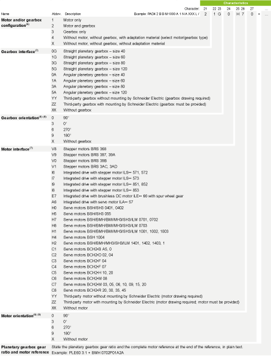
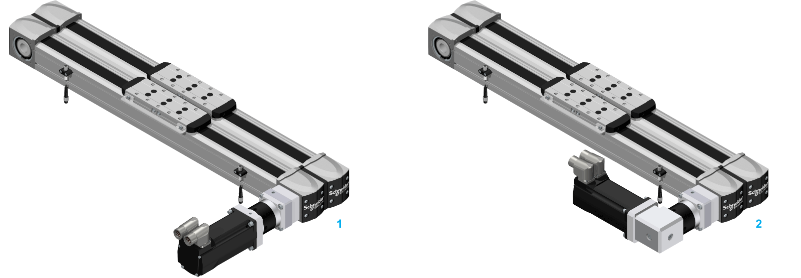
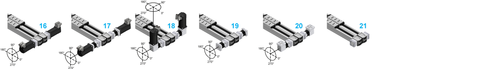

# Type Code

Type Code

Overview

To find the appropriate axis information, refer to the [type plate located on the axis](#XREF_D_SE_0104489_1).

(1) For the minimum and maximum stroke per size, refer to the [mechanical data of the axis](../ROBOTICS_Technical_Data/ROBOTICS_Technical_Data-3.htm#XREF_D_SE_0088553_1).

(2) Supplied with a 0.1 m (3.9 in) cable and equipped with an M8 connector. For sensor extension cables, refer to [Sensor Extension Cables](../ROBOTICS_Replacement_Equipment/ROBOTICS_Replacement_Equipment-3.htm#XREF_D_SE_0106430_9).

(3) Only carriage couples of the same type can be used. For more carriage couples, contact your local Schneider Electric representative.

(4) For the minimum distance between two carriage couples, refer to the [dimensional drawing table of the axis](../ROBOTICS_Technical_Data/ROBOTICS_Technical_Data-9.htm#XREF_D_SE_0100279_1).

(5) For further information, refer to [Mounting Options for the Motor and/or the Gearbox](#XREF_D_SE_0104489_7).

(6) For further information, refer to [Motor and/or Gearbox Orientation and Configuration](#XREF_D_SE_0104489_4).

(7) Valid for both motors and/or gearboxes of the PAD42EB.

(8) In case of a straight planetary gearbox, the orientation references to the setscrew of the drive unit adaptation.

(9) With reference to the motor connectors.

If you have questions concerning the type code, contact your local Schneider Electric representative.

Types of Mechanical Drive Elements

The Lexium PAD4-Series is available with two toothed belts (PAD42BB and PAD42EB) or with only one toothed belt and a supporting side (PAD42PB). For a detailed name description of the Lexium PAD4-Series, refer to [Type Code](#XREF_D_SE_0104489_1).

Types of Linear Guides

The Lexium PAD4-Series is equipped with two inner recirculating ball bearing guides bearing guide to guide the carriages. For a detailed name description of the Lexium PAD4-Series, refer to [Type Code](#XREF_D_SE_0104489_1).

Mounting Options for the Motor and/or the Gearbox

The following graphic presents the mounting options for the motor and/or the gearbox for the Lexium PAD4-Series.

NOTE: For a PAD42BB or PAD42PB axis without motor, gearbox, or adaptation material: in the [type code](#XREF_D_SE_0104489_1), select L or R as character under Mounting options for motor and/or gearbox to define the position of the [double coupling or the distance plate](ROBOTICS_System_Overview-3.htm#XREF_D_SE_0104485_3).

Lexium PAD42BB

Lexium PAD42EB

Lexium PAD42PB

H   Hollow shaft at both ends (only PAD42EB)

L   On left-hand side

R   On right-hand side

T   On both sides at one end (only PAD42EB)

NOTE: For a detailed name description of the Lexium PAD4-Series, refer to [Type Code](#XREF_D_SE_0104489_1).

Mounting Direction for Motor and Gearbox

The following graphic presents the possible [mounting direction](../glossary/glossary.htm#XREF_D_SE_0058496_14) of the motor and gearbox combinations. The motor or the gearbox is coupled by using a preloaded coupling.

1   Straight mounted

2   Mounted with angle gearbox, rotatable 4 x 90°

Motor and/or Gearbox Orientation and Configuration

The following graphics represent the possible motor and/or gearbox orientation and configuration for the Lexium PAD4-Series.

NOTE: For a PAD42BB or PAD42PB axis without motor, gearbox, or adaptation material: in the [type code](#XREF_D_SE_0104489_1), select L or R as character under Mounting options for motor and/or gearbox to define the position of the double coupling or the distance plate.

|  |  |
| --- | --- |
| 1 PAD42EB••••••••••••H/XXXXXXX | |

|  |  |
| --- | --- |
| 2 PAD42•B••••••••••••L/1XXX•••  3 PAD42•B••••••••••••L/2•G••••  4 PAD42•B••••••••••••L/2•A••••  5 PAD42•B••••••••••••L/3•G•XXX | 6 PAD42•B••••••••••••L/3•A•XXX  7 PAD42•B••••••••••••L/4XXX•••  8 PAD42•B••••••••••••L/XXXXXXX |

|  |  |
| --- | --- |
| 9 PAD42•B••••••••••••R/1XXX•••  10 PAD42•B••••••••••••R/2•G••••  11 PAD42•B••••••••••••R/2•A••••  12 PAD42•B••••••••••••R/3•G•XXX | 13 PAD42•B••••••••••••R/3•A•XXX  14 PAD42•B••••••••••••R/4XXX•••  15 PAD42•B••••••••••••R/XXXXXXX |

|  |  |
| --- | --- |
| 16 PAD42EB••••••••••••T/1XXX•••  17 PAD42EB••••••••••••T/2•G••••  18 PAD42EB••••••••••••T/2•A•••• | 19 PAD42EB••••••••••••T/3•G•XXX  20 PAD42EB••••••••••••T/3•A•XXX  21 PAD42EB••••••••••••T/4XXX••• |

For a detailed name description of the Lexium PAD4-Series, refer to [Type Code](#XREF_D_SE_0104489_1).

Designation of Customized Version

In the case of a customized version, the type code contains one or several dollar signs "$". Example: PAD42BBM1000A$NAXXXL / 2 1G 0 H7 0

If you have questions concerning customized versions, contact your local Schneider Electric service representative.

EIO0000004366.00

© 2020 Schneider Electric. All rights reserved.