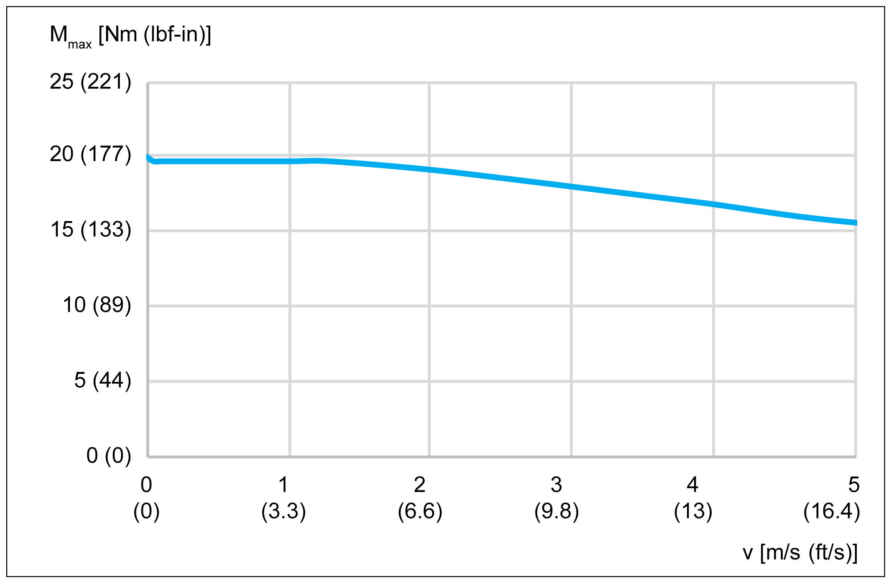
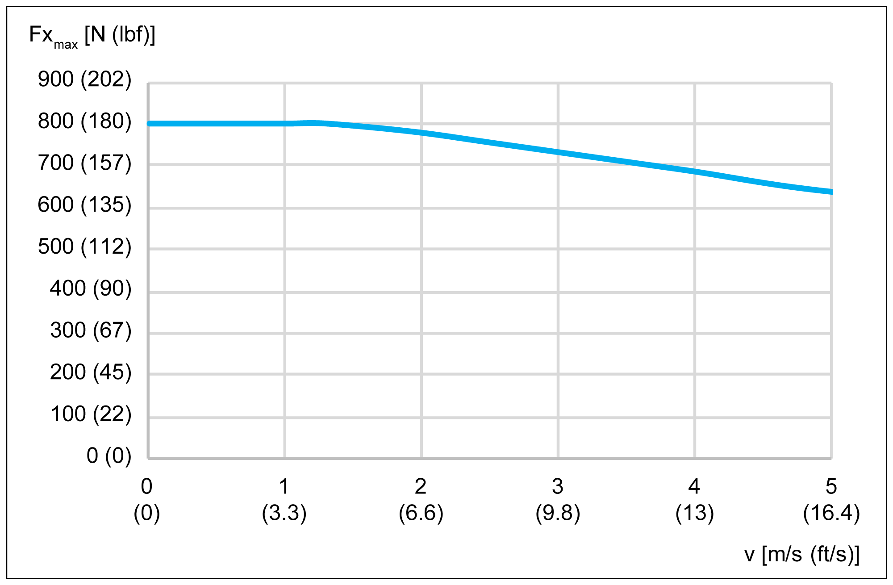
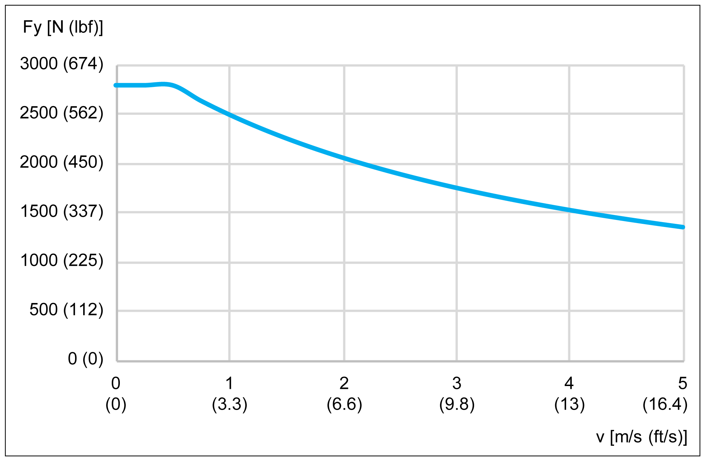
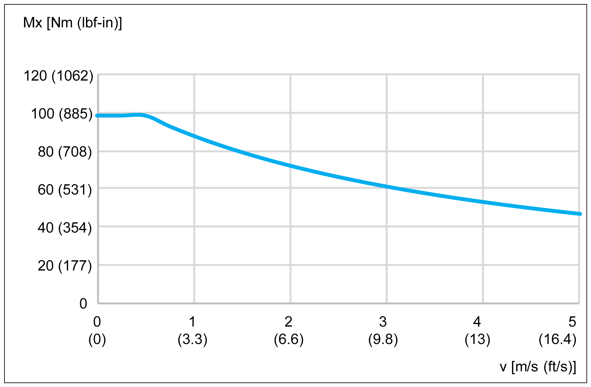
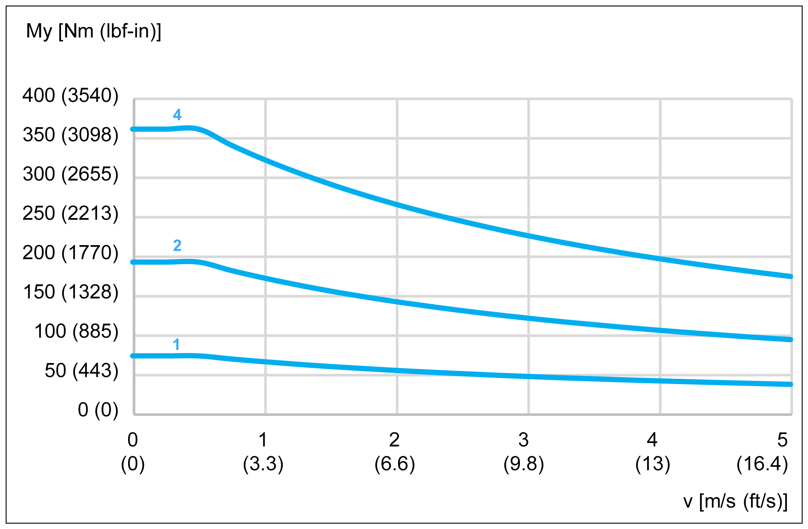
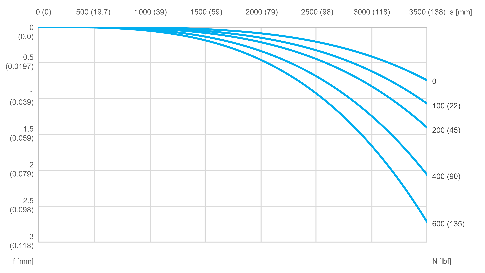
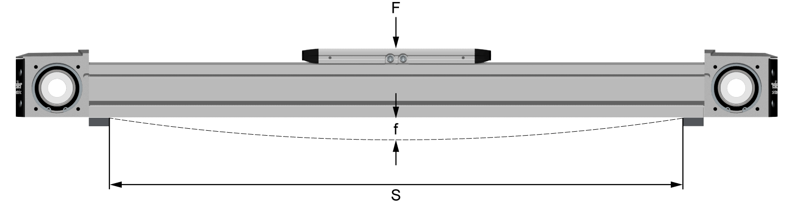

# Characteristic curves

Characteristic curves

Maximum drive torque Mmax

Lexium PAD42BB:

Lexium PAD42EB and Lexium PAD42PB:

Maximum feed force Fx

Lexium PAD42BB:

Lexium PAD42EB and Lexium PAD42PB:

Maximum force Fy

Lexium PAD42BB and Lexium PAD42PB:

Lexium PAD42EB

Maximum force Fz

Lexium PAD42BB and Lexium PAD42PB:

Lexium PAD42EB

Maximum force Mx

Lexium PAD42BB and Lexium PAD42PB:

Lexium PAD42EB

Maximum force My

Lexium PAD42BB and Lexium PAD42PB:

1   Carriage type 1

2   Carriage type 2

4   Carriage type 4

Lexium PAD42EB

1   Carriage type 1

2   Carriage type 2

4   Carriage type 4

Maximum force Mz

Lexium PAD42BB and Lexium PAD42PB:

1   Carriage type 1

2   Carriage type 2

4   Carriage type 4

Lexium PAD42EB

1   Carriage type 1

2   Carriage type 2

4   Carriage type 4

Service life

A The forces and torques (Fy, Fz, Mx, Mz, My) are calculated for an expected service life of 30,000 km (18,641 mi). This is shown with k factor equal 1.0 in the figure.

Maximum deflection

In order to limit deflection of the axis at long strokes, the axis must be supported. The diagram presents the deflection f [mm (in)] of the axis with respect to the support distance S [mm (in)] and the acting force F [N (lbf)]. Excessive deflection reduces the service life of the axis.

NOTE: The figure presents the deflection of the axis body with firmly clamped supporting points.

EIO0000004366.00

© 2020 Schneider Electric. All rights reserved.