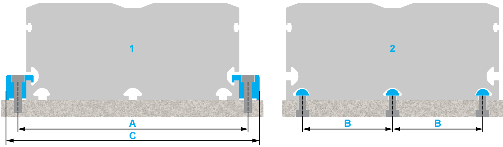

# Mounting the Axis

Mounting the Axis

Overview

To mount the axis to the installation surface, either use clamping claws (lateral fastening) or slot nuts (bottom or lateral fastening) for the T-Slots at the axis body.

The end blocks protrude beyond the axis body at the ends. The end blocks must not be the only parts supported by the installation surface.

If the lateral T-slots are used for installation, the sensor cable cannot be routed in the T-slots.

For information about appropriate clamping claws and slot nuts, refer to [Replacement Equipment and Accessories](../ROBOTICS_Replacement_Equipment/ROBOTICS_Replacement_Equipment-1.htm#XREF_D_SE_0065517_1).

|  |
| --- |
| Warning_Color.gifWARNING |
| GREAT MASS OR FALLING PARTS |
| oUse a suitable crane or other suitable lifting gear to lift the axis if this is required by the mass of the axis.  oUse the necessary personal protective equipment (for example, safety shoes, safety glasses and protective gloves).  oMount the axis in such a way (tightening torque, securing screws) that parts cannot come loose, even in the case of shocks and vibration.  oTake all necessary measures to avoid unanticipated movements of the axis mounted in vertical or tilted positions. |
| Failure to follow these instructions can result in death, serious injury, or equipment damage. |

|  |
| --- |
| NOTICE |
| INCORRECT INSTALLATION |
| oIf motors with a cross section greater than the cross section of the axis body are used, the axis must be supported or the installation surface must be cut out as required.  oThe greater the load or the demands on the running accuracy, the shorter the distance that must be between the slot nuts or the clamping claws.  oDo not mount the axis at the end blocks. |
| Failure to follow these instructions can result in equipment damage. |

Running Accuracy

The length of the axis can have an impact on the running accuracy. A long axis may bend more easily, which can cause a reduced running accuracy. When mounting the axis, ensure that there is no gap between the axis and the installation surface so that the installation surface is in full contact with the mounting surface of the axis.

Dimensions for Mounting

The axis body of the Lexium PAD4-Series is an extruded aluminum profile. The axis can be mounted to a frame by using appropriate clamping claws or slot nuts for the T-slots at the axis body.

NOTE: Note that the two outer T-slots at the bottom of the Lexium PAD42 are not symmetrical. For further information, refer to the corresponding dimensional drawing in [Mechanical Data](../ROBOTICS_Technical_Data/ROBOTICS_Technical_Data-3.htm#XREF_D_SE_0088553_1).

The T-Slots are located on:

oBoth sides of the axis body

oBottom side of the axis body

1   Fastening with clamping claws

2   Fastening with slot nuts

When installing the axis, take into account the tapped hole distance for the slot nuts or screws.

The following table presents the distance between the tapped holes and the appropriate screws:

| Description | Dimension | Unit | Value |
| --- | --- | --- | --- |
| PAD42 |
| Distance between tapped holes(1) | A | mm (in) | 144 (5.7) |
| Distance between slots(1) | B | 55 (2.17) |
| Clamping claw width | C | 158 (6.2) |
| Slot nut type | – | 5 (0.197) |
| Screw – ISO 4762 | – | – | M5 |
| (1) For further information, refer to the respective dimensional drawing in [Mechanical Data](../ROBOTICS_Technical_Data/ROBOTICS_Technical_Data-3.htm#XREF_D_SE_0088553_1). | | | |

The following table presents the maximum distances per side at medium loads for mounting the axis with clamping claws or slot nuts:

| Fastening material | Unit | Value |
| --- | --- | --- |
| PAD42 |
| Clamping claws | mm (in) | 600 (23.6) |
| Slot nuts | 600 (23.6) |

NOTE: The greater the load or the demands on the running accuracy, the shorter the distance that must be between the slot nuts or the clamping claws.

Prerequisites

You need the following tools to mount the axis:

oSet of hex keys

oTorque wrench with a set of hexagon sockets

oDial gauge

NOTE: Do not use ball head hex keys. Excessive torque may cause the ball head to break away.

For suitable parts, refer to [Replacement Equipment and Accessories](../ROBOTICS_Replacement_Equipment/ROBOTICS_Replacement_Equipment-1.htm#XREF_D_SE_0065517_1).

Mounting the Axis

NOTE: When mounting the axis, keep in mind that it may have to be accessed for maintenance.

| Step | Action |
| --- | --- |
| 1 | Ensure that the planarity of the installation surface does not exceed 0.1 mm/m (0.0012 in/ft). |
| 2 | Carefully position the axis on its installation surface. |
| 3 | Tighten the fastening screws of the clamping claws or slot nuts with a low tightening torque. |
| 4 | Provide a reference plane alongside the axis body. |
| 5 | Place a dial gauge onto the carriage. |
| 6 | Move the carriage and record the deviation regarding the reference plane over the entire stroke. |
| 7 | Correct the deviations by lateral alignment of the axis and by tightening the screws appropriately.  NOTE: Observe the [standard tightening torques](ROBOTICS_Transport_and_Comissioning-6.htm#XREF_D_SE_0088555_4). |

EIO0000004366.00

© 2020 Schneider Electric. All rights reserved.