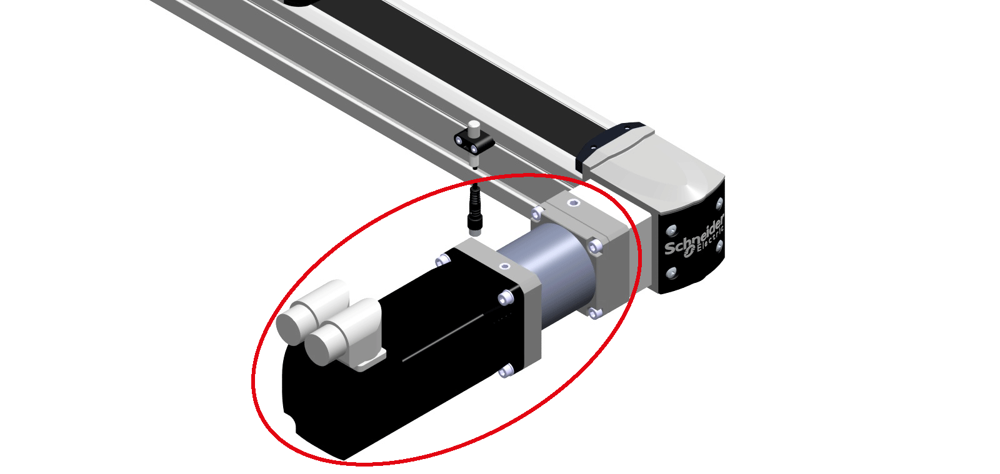

# Hot Surfaces

Hot Surfaces

The motor, gearbox, and adaptation materials of the axis may exceed 70 °C (158 °F).

The following graphic presents the hot surfaces on the axis.

|  |
| --- |
| Warning_Color.gifWARNING |
| HOT SURFACES |
| oAvoid unprotected contact with hot surfaces.  oDo not allow flammable or heat-sensitive parts in the immediate vicinity of hot surfaces.  oVerify that the heat dissipation is sufficient by performing a test run under maximum load conditions. |
| Failure to follow these instructions can result in death, serious injury, or equipment damage. |