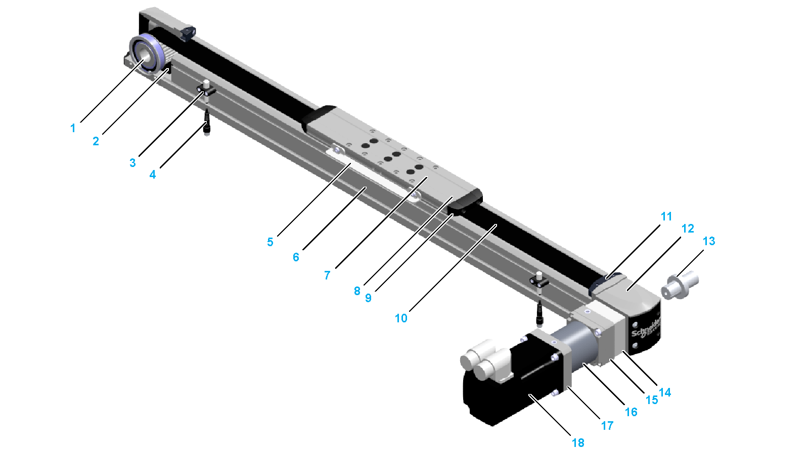

# Components Overview

Components Overview

|  |  |
| --- | --- |
| 1 Toothed belt pulley  2 Toothed belt  3 Sensor holder (optional equipment)  4 [Sensor](../glossary/glossary.htm#XREF_D_SE_0058496_37) with cable and connector (optional equipment)  5 Contact plate (optional equipment)  6 Axis body  7 Carriage  8 Strip deflector (optional equipment)  9 Rubber buffer  10 Cover strip (optional equipment) | 11 Cover strip clamp (optional equipment)  12 End block  13 Shaft extension (optional equipment)  14 Coupling housing including coupling (optional equipment)  15 Gearbox adaptation (optional equipment)  16 Gearbox (optional equipment)  17 Motor adaptation (optional equipment)  18 Motor (optional equipment) |