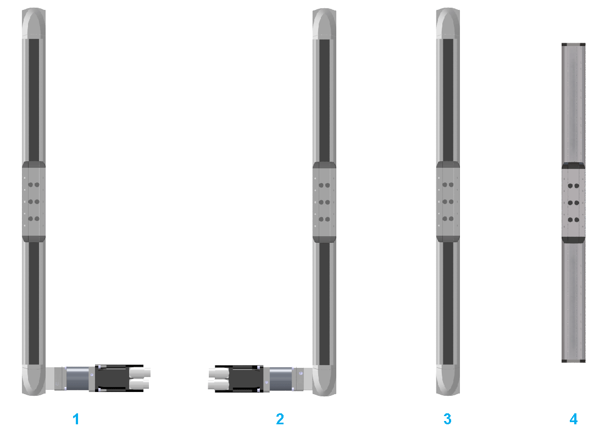

# Mounting Options for Motor and/or Gearbox

Mounting Options for Motor and/or Gearbox

The following graphic presents the mounting options for motor and/or gearbox for the Lexium PAS4•B-Series.

1   With mounted motor and/or gearbox on right-hand side

2   With mounted motor and/or gearbox on left-hand side

3   Without mounted motor or gearbox (hollow shaft at both ends)

4   Support axis (without drive facility)