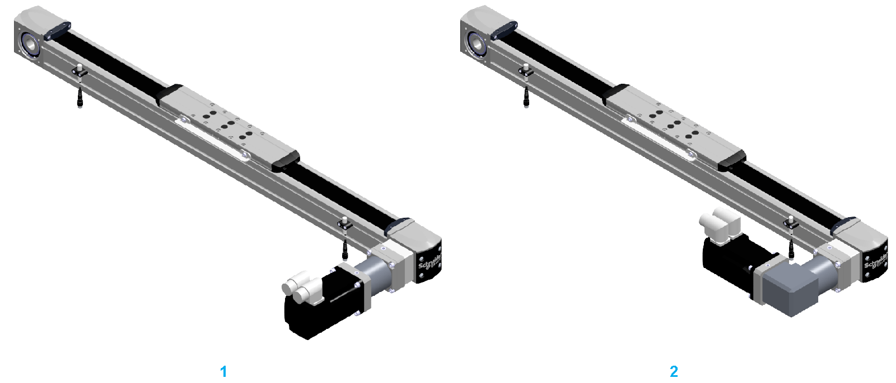

# Mounting Direction for Motor and Gearbox

Mounting Direction for Motor and Gearbox

The following graphic presents the possible [mounting positions](../glossary/glossary.htm#XREF_D_SE_0058496_14) of the motor and gearbox combinations. The motor or the gearbox is coupled by using a preloaded elastomer coupling.

1   Straight mounted

2   Mounted with angle gearbox, rotatable 4 x 90°