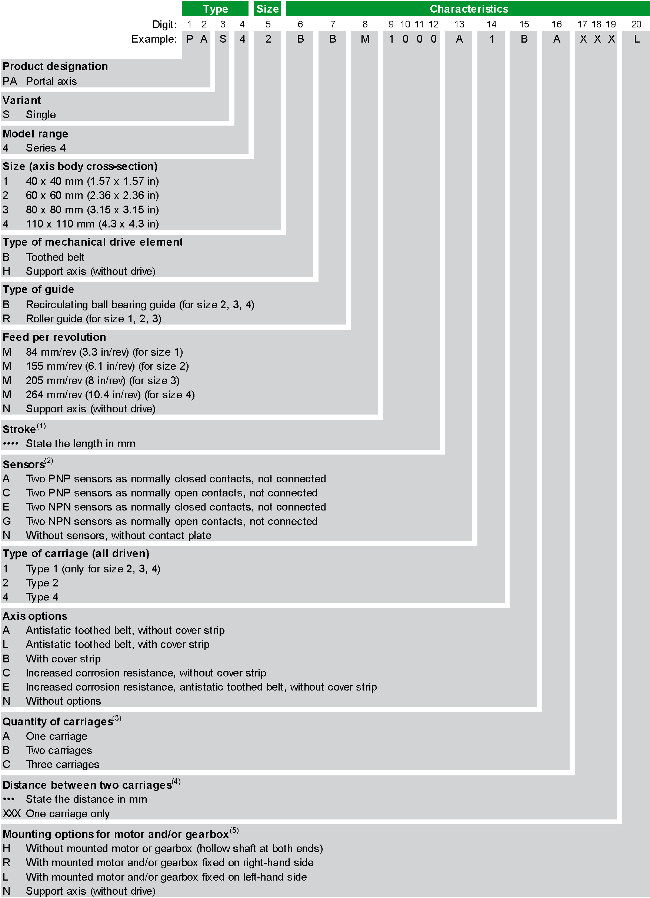
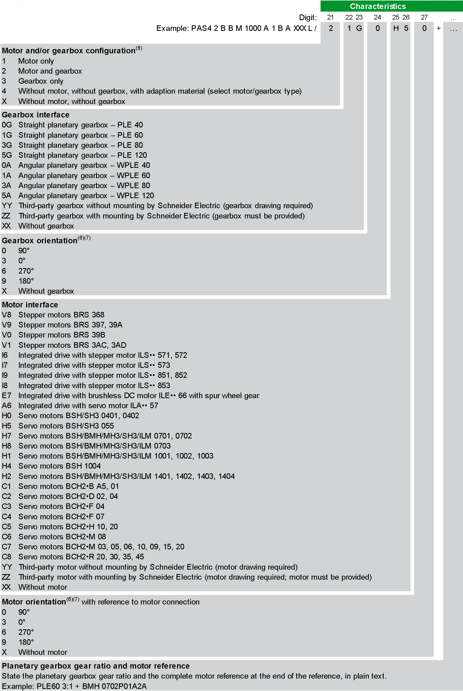

# Overview

Overview

To find your appropriate axis information, refer to the [type plate](ROBOTICS_System_Overview-5.htm#XREF_D_SE_0086150_1) located on the axis.

(1) For the minimum and maximum stroke per size, refer to the [mechanical data of the axis](../ROBOTICS_Technical_Data/ROBOTICS_Technical_Data-3.htm#XREF_D_SE_0088553_1).

(2) Supplied with a 0.1 m (3.9 in) cable equipped with an M8 connector. For other sensor extension cable lengths, refer to [Sensor Extension Cables](../ROBOTICS_Replacement_Equipment/ROBOTICS_Replacement_Equipment-3.htm#XREF_D_SE_0086180_9).

(3) Only carriages of the same type can be used. All carriages are driven. For more carriages, contact your local Schneider Electric service representative.

(4) For the minimum distance between two carriages, refer to the respective dimensional drawing of the axis in [Mechanical Data](../ROBOTICS_Technical_Data/ROBOTICS_Technical_Data-3.htm#XREF_D_SE_0088553_1).

(5) For further information, refer to [Mounting Options for Motor and/or Gearbox](ROBOTICS_System_Overview-3.htm#XREF_D_SE_0061604_16).

(6) For further information, refer to [Motor and/or Gearbox Orientation and Configuration](#XREF_D_SE_0061606_4).

(7) Adapter plate orientation with reference to the setscrew.

If you have questions concerning the type code, contact your local Schneider Electric service representative.