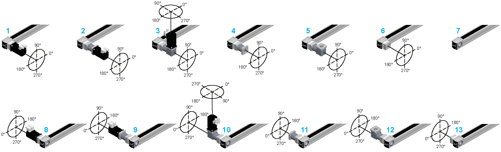

# Motor and/or Gearbox Orientation and Configuration

Motor and/or Gearbox Orientation and Configuration

The following graphic presents the possible motor and/or gearbox orientation and configuration for the Lexium PAS4•B-Series.

1   PAS4•B•••••••••••••R/1XXX•••

2   PAS4•B•••••••••••••R/2•G••••

3   PAS4•B•••••••••••••R/2•A••••

4   PAS4•B•••••••••••••R/3•G•XXX

5   PAS4•B•••••••••••••R/3•A•XXX

6   PAS4•B•••••••••••••R/4XXX•••

7   PAS4•B•••••••••••••H/XXXXXXX

8   PAS4•B•••••••••••••L/1XXX•••

9   PAS4•B•••••••••••••L/2•G••••

10   PAS4•B•••••••••••••L/2•A••••

11   PAS4•B•••••••••••••L/3•G•XXX

12   PAS4•B•••••••••••••L/3•A•XXX

13   PAS4•B•••••••••••••L/4XXX•••

For a detailed name description of the Lexium PAS4•B-Series, refer to [Type Code](#XREF_D_SE_0061606_1).