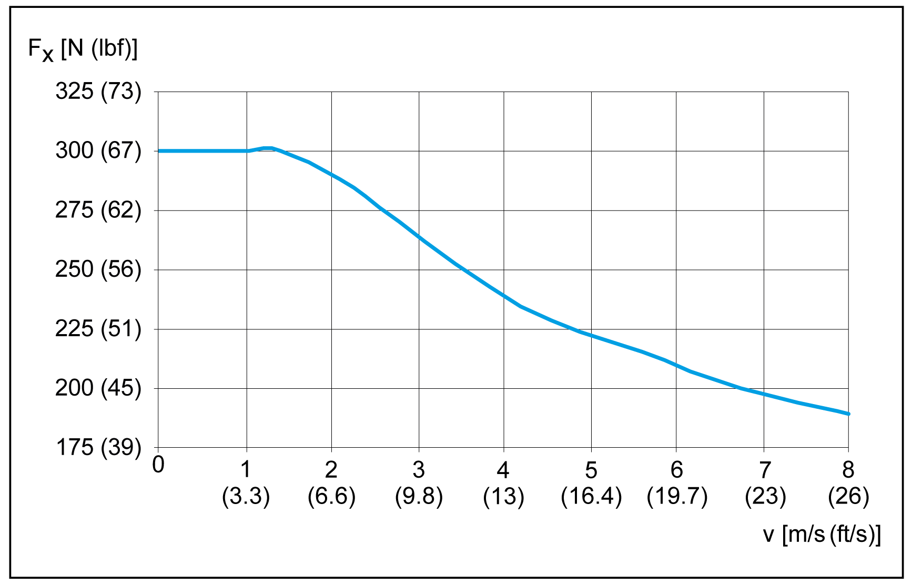
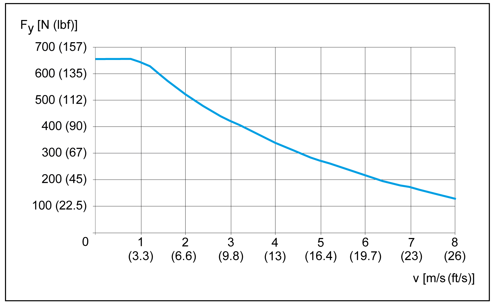
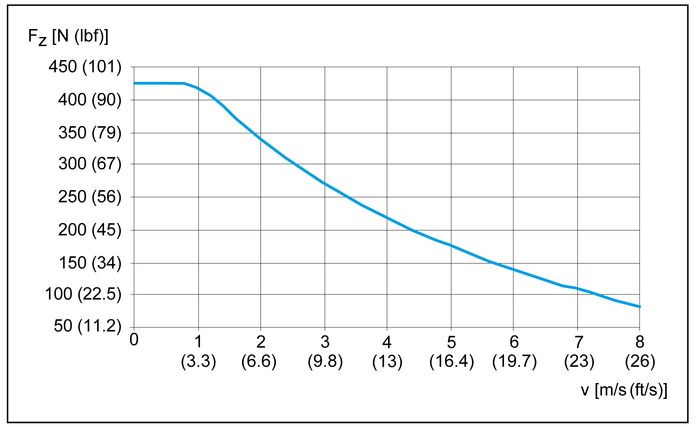
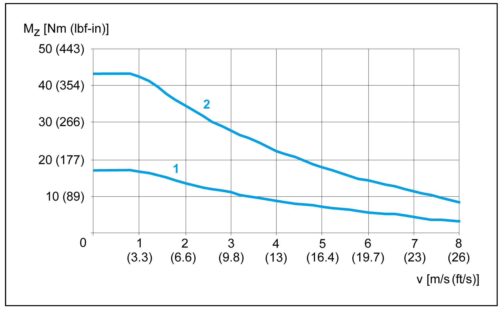
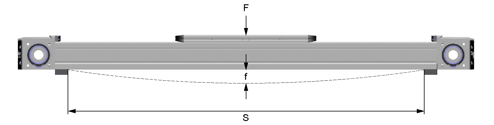

# Characteristic Curves of Lexium PAS41BR

Characteristic Curves of Lexium PAS41BR

Maximum feed force Fxmax

Maximum force Fy

Maximum force Fz

Maximum drive torque Mmax

Maximum torque carriage Mx

Maximum torque carriage My

1   Carriage type 2

2   Carriage type 4

Maximum torque carriage Mz

1   Carriage type 2

2   Carriage type 4

Service life

A The forces and torques (Fy, Fz, Mx, Mz, My) are calculated for an expected service life of 30,000 km (18,641 mi). This is shown with k factor equal 1.0 in the graphic.

Maximum deflection

In order to limit deflection of the axis at long strokes, the axis must be supported. The diagram presents the deflection f [mm (in)] of the axis with respect to the support distance S [mm (in)] and the acting force F [N (lbf)]. Excessive deflection reduces the service life of the axis.

NOTE: The graphics presents the deflection of the axis body with firmly clamped supporting points.