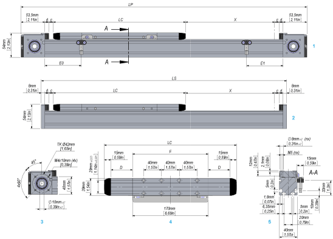

# Dimensional Drawing of Lexium PAS41BR

Dimensional Drawing of Lexium PAS41BR

1   Portal axis

2   Support axis

3   End block

4   Carriage type 2 (type 4 has more tapped holes for mounting)

5   Section of axis

| Parameter | Dim-ension | Unit | Lexium PAS41BR | | | |
| --- | --- | --- | --- | --- | --- | --- |
| Carriage type 2 | | Carriage type 4 | |
| without  cover strip | with  cover strip | without  cover strip | with  cover strip |
| Total length of portal axis(1) | LP | mm  (in) | 327 + X  (13 + X) | 442 + X  (17.4 + X) | 407 + X  (16 + X) | 522 + X  (20.6 + X) |
| Total length of support axis | LS | mm  (in) | 236 + X  (9.3 + X) | 351 + X  (13.8 + X) | 316 + X  (12.4 + X) | 431 + X  (17 + X) |
| Stroke | X | – | See technical data | | | |
| Carriage length | LC | mm  (in) | 200  (7.9) | 297  (11.7) | 280  (11) | 377  (14.8) |
| Profile length of carriage | F | mm  (in) | 170  (6.7) | | 250  (9.8) | |
| Number of tapped holes for mounting(2) | n | – | 8 | | 12 | |
| Distance between tapped holes | – | mm  (in) | 40 +/- 0.03  (1.57 +/- 0.00118) | | 40 +/- 0.03  (1.57 +/- 0.00118) | |
| Sensor position at drive end | E0 | mm  (in) | 25  (0.98) | 82  (3.2) | 25  (0.98) | 82  (3.2) |
| Sensor position opposite drive end | E1 | mm  (in) | 25  (0.98) | 82  (3.2) | 105  (4.1) | 162  (6.4) |
| [Stroke reserve](../glossary/glossary.htm#XREF_D_SE_0058496_25) up to mechanical stop | c | mm  (in) | 10  (0.39) | | | |
| Length of cover strip clamp | d | mm  (in) | – | 9  (0.354) | – | 9  (0.354) |
| Deflection of cover strip | D | mm  (in) | – | 48.5  (1.9) | – | 48.5  (1.9) |
| Minimum distance between two carriages | – | mm  (in) | 35  (1.38) | 90  (3.54) | 35  (1.38) | 90  (3.54) |
| (1) For a axis with more than one carriage, add the carriage length (LC) and the distance between the carriages for each additional carriage.  (2) Prepared for locating dowels. For suitable locating dowels, refer to [Replacement Equipment](../ROBOTICS_Replacement_Equipment/ROBOTICS_Replacement_Equipment-3.htm#XREF_D_SE_0086180_1). | | | | | | |