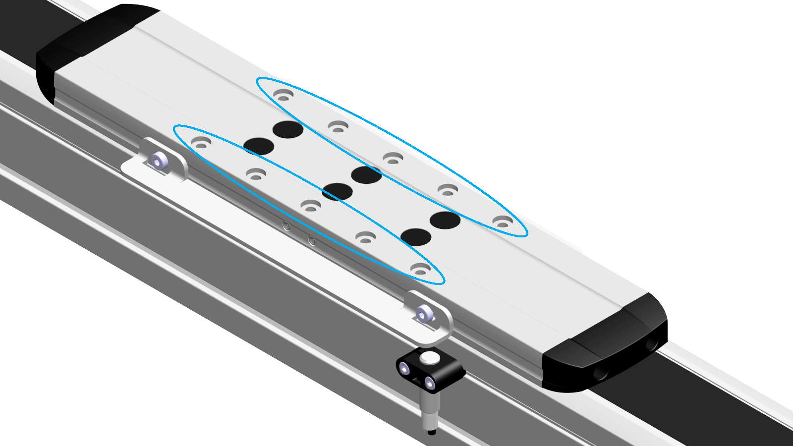

# Overview

Overview

To fasten the payload, fastening threads are provided at the carriage.

Each thread has a counterbore for a locating dowel for reproducible mounting of the payload. For a section view of the carriage, refer to the dimensional drawing of the corresponding axis in [Mechanical Data](../ROBOTICS_Technical_Data/ROBOTICS_Technical_Data-3.htm#XREF_D_SE_0088553_1).

For suitable parts, refer to [Replacement Equipment and Accessories](../ROBOTICS_Replacement_Equipment/ROBOTICS_Replacement_Equipment-1.htm#XREF_D_SE_0065517_1).