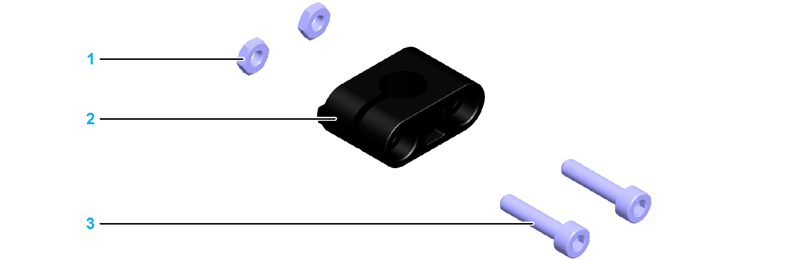

# Fastening Material for Sensor Mounting

Fastening Material for Sensor Mounting

A sensor is mounted to the axis body by using a sensor holder. The axis body provides a T-slot for the sensor holder. This T-slot has cutouts at both end blocks for inserting the fastening nuts. In addition, the sensor holder has cams at both sides to keep the sensor from turning in the T-slot.

The following graphic presents the components of a sensor holder:

1   Fastening nuts\*

2   Sensor holder

3   Hex socket screw

\* For fastening the sensor in the sensor holder and the sensor holder in the T-Slot.