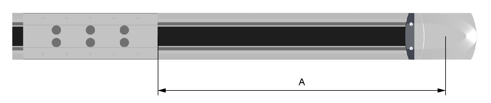

# Distance and Vibration Measurement

Distance and Vibration Measurement

For adjusting the toothed belt tension, you can use either distance measurement or vibration measurement:

oDistance measurement

The position of the toothed belt tensioner is measured with a caliper gauge. The position of the toothed belt tensioner is used to preload the toothed belt.

oVibration measurement

To restore the precise factory-adjusted toothed belt tension, use a belt tension meter for vibration measurement. The factory-adjusted toothed belt tension is presented in the following table. The measured preload values FV depend on the selectable measuring distance A and the weight of the respective toothed belt.

The measuring distance A is measured:

oFrom the center of the end block

oTo the edge of the carriage

| Description | Parameter | Unit | Value | | | |
| --- | --- | --- | --- | --- | --- | --- |
| PAS41 | PAS42 | PAS43 | PAS44 |
| Toothed belt type | – | – | HTD3 | HTD5 | HTD5 | HTD8 |
| Width | – | mm (in) | 15 (0.59) | 25 (0.98) | 30 (1.18) | 50 (1.97) |
| Pitch | – | 3 (0.118) | 5 (0.197) | 5 (0.197) | 8 (0.315) |
| Weight | – | g/m (lb/ft) | 32 (0.0215) | 96 (0.065) | 118 (0.08) | 311 (0.21) |
| Toothed belt tension | Fv | N (lbf) | 145…180  (32.6…40.5) | 570…710  (128…160) | 670…840  (151…189) | 1915…2400  (431…540) |

For any questions concerning the vibration measurement, contact your your local Schneider Electric service representative.