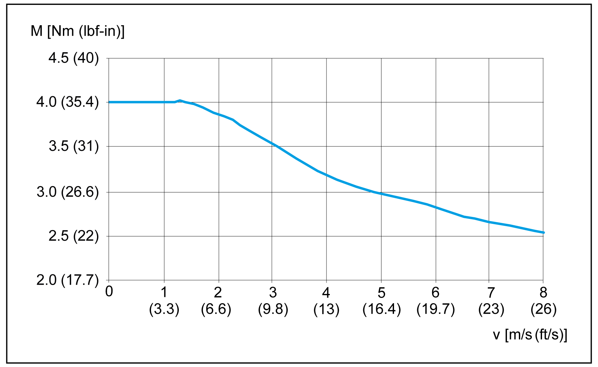
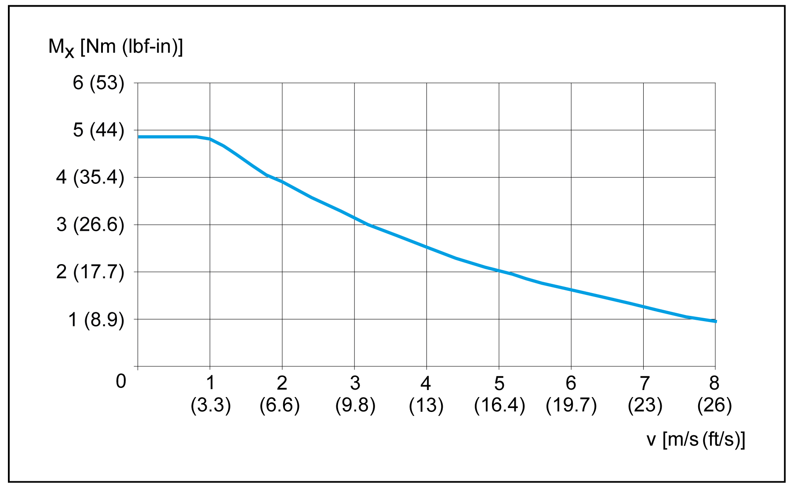
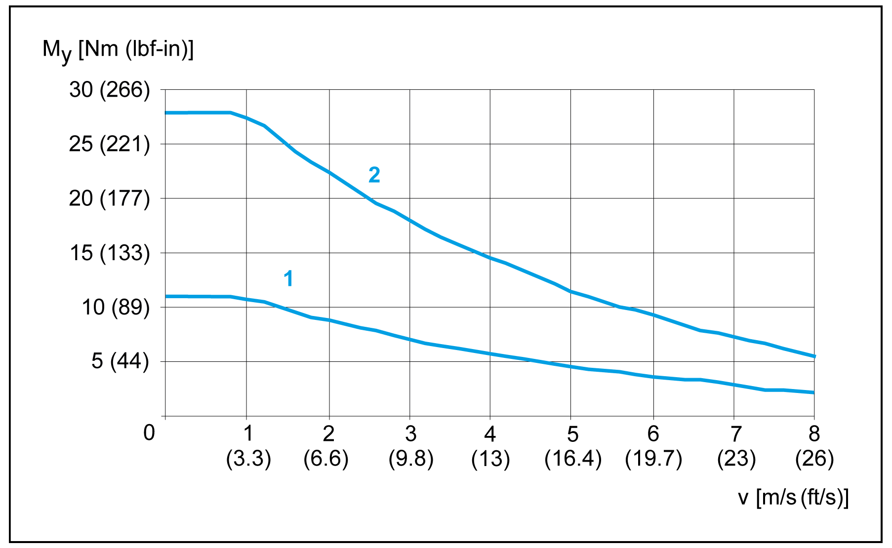
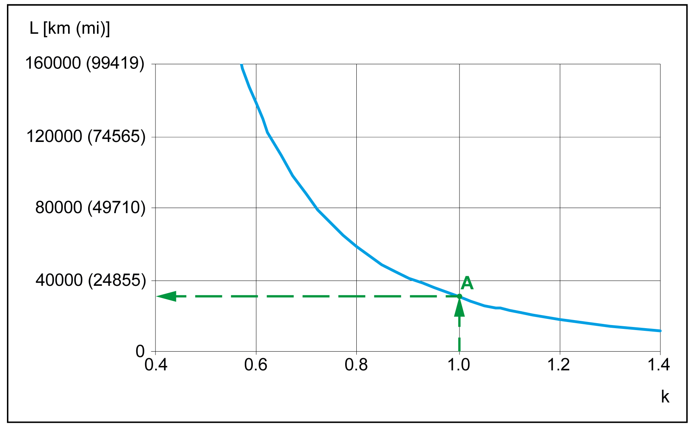
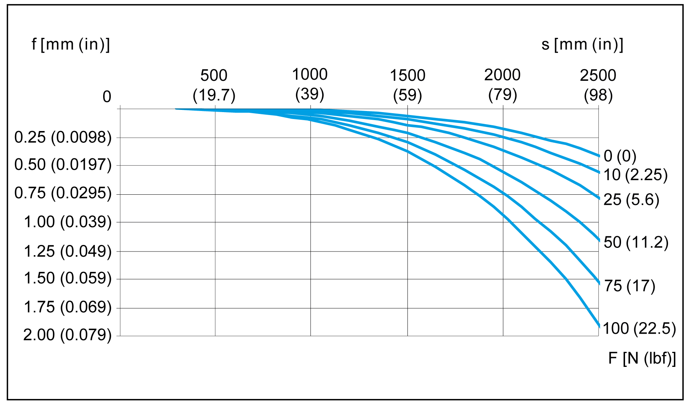

# Lexium PAS41BR and Lexium PAS41HR

Lexium PAS41BR and Lexium PAS41HR

Overview

Here you will find the following information:

o[Mechanical data of Lexium PAS41BR](#XREF_D_SE_0061682_12)

o[Mechanical data of Lexium PAS41HR](#XREF_D_SE_0061682_13)

o[Characteristic curves of Lexium PAS41BR](#XREF_D_SE_0061682_3)

o[Dimensional drawing of Lexium PAS41BR](#XREF_D_SE_0061682_14)

Mechanical Data of Lexium PAS41BR

NOTE: The maximum forces and torques are calculated to a service life of 30,000 km (18,641 mi) and can be exceeded. For an application-specific calculation of the service life of the axis, refer to [Service Life](ROBOTICS_Technical_Data-9.htm#XREF_D_SE_0067147_1).

| Parameter | Unit | Value for Lexium PAS41BR | | | |
| --- | --- | --- | --- | --- | --- |
| Carriage type 2 | | Carriage type 4 | |
| without  cover strip | with  cover strip | without  cover strip | with  cover strip |
| Toothed belt | – | 15HTD3  width: 15 mm (0.59 in), profile: HTD, pitch 3 mm (0.118 in) | | | |
| Type of guide | – | Roller guide | | | |
| Carriage length | mm  (in) | 200  (7.9) | 297  (11.7) | 280  (11) | 377  (14.8) |
| [Feed constant](../glossary/glossary.htm#XREF_D_SE_0058496_36) | mm/rev  (in/rev) | 84  (3.3) | | | |
| Effective diameter toothed belt pulley | mm  (in) | 26.738  (1.05) | | | |
| Maximum feed force Fxmax(1) | N  (lbf) | 300  (67) | | | |
| Maximum velocity(2) | m/s  (ft/s) | 8  (26) | | | |
| Maximum acceleration(2) | m/s2  (ft/s2) | 20  (66) | | | |
| Maximum drive torque Mmax(1) | Nm  (lbf–in) | 4  (35.4) | | | |
| [Breakaway torque](../glossary/glossary.htm#XREF_D_SE_0058496_34) 0-stroke axis | Nm  (lbf–in) | 0.3  (2.66) | | | |
| Breakaway torque per additional carriage | Nm  (lbf–in) | 0.1  (0.89) | | | |
| Moment of inertia 0-stroke axis | kg×cm2  (lb×in2) | 1.0  (0.34) | 1.2  (0.41) | 1.2  (0.41) | 1.4  (0.48) |
| Moment of inertia per additional carriage | kg×cm2  (lb×in2) | 0.8  (0.273) | 1.0  (0.34) | 1.0  (0.41) | 1.2  (0.41) |
| Moment of inertia per m (in) of stroke | kg×cm2  (lb×in2) | 0.1  (0.034) | | | |
| Moment of inertia per kg (lb) payload | kg×cm2  (lb×in2) | 1.8  (0.62) | | | |
| Maximum force Fy(1) | Nm  (lbf–in) | 660  (148) | | | |
| Maximum force Fz(1) | Nm  (lbf–in) | 430  (97) | | | |
| Maximum torque carriage Mx(1) | Nm  (lbf–in) | 5  (44) | | | |
| Maximum torque carriage My(1) | Nm  (lbf–in) | 11  (97) | | 28  (248) | |
| Maximum torque carriage Mz(1) | Nm  (lbf–in) | 17  (150) | | 43  (381) | |
| Mass 0-stroke axis | kg  (lb) | 1.6  (3.5) | 2  (4.4) | 1.9  (4.2) | 2.3  (5.1) |
| Mass per additional carriage (with axis body) | kg  (lb) | 0.9  (2.0) | 1.3  (2.87) | 1.2  (2.65) | 1.6  (3.5) |
| Mass per m (in) of stroke | kg  (lb) | 2.25  (5) | | | |
| Moving mass carriage | kg  (lb) | 0.5  (1.1) | 0.6  (1.32) | 0.6  (1.32) | 0.7  (1.54) |
| Maximum stroke(3) | mm  (in) | 3000  (118) | 2880  (113) | 2920  (115) | 2800  (110) |
| Minimum stroke(4) | mm  (in) | 125  (4.9) | | | |
| [Position repeatability](../glossary/glossary.htm#XREF_D_SE_0058496_33)(2) | mm  (in) | +/- 0.05  (+/- 0.00197) | | | |
| (1) Maximum permissible forces and torques decrease at increasing velocities. Refer to the characteristic curves following this table.  (2) Depending on load and stroke.  (3) For information about greater strokes, contact your local Schneider Electric representative.  (4) Required for lubrication of the linear guide. | | | | | |

Mechanical Data of Lexium PAS41HR

| Parameter | Unit | Value for Lexium PAS41HR | | | |
| --- | --- | --- | --- | --- | --- |
| Carriage type 2 | | Carriage type 4 | |
| without  cover strip | with  cover strip | without  cover strip | with  cover strip |
| Breakaway force | N  (lbf) | 5  (1.12) | | | |
| Breakaway force per additional carriage | N  (lbf) | 5  (1.12) | | | |
| Mass 0-stroke axis | kg  (lb) | 1.1  (2.43) | 1.5  (3.3) | 1.4  (3.1) | 1.8  (4) |

For further data (if applicable), refer to Lexium PAS41BR.

Characteristic Curves of Lexium PAS41BR

Maximum feed force Fxmax

Maximum force Fy

Maximum force Fz

Maximum drive torque Mmax

Maximum torque carriage Mx

Maximum torque carriage My

1   Carriage type 2

2   Carriage type 4

Maximum torque carriage Mz

1   Carriage type 2

2   Carriage type 4

Service life

A The forces and torques (Fy, Fz, Mx, Mz, My) are calculated for an expected service life of 30,000 km (18,641 mi). This is shown with k factor equal 1.0 in the graphic.

Maximum deflection

In order to limit deflection of the axis at long strokes, the axis must be supported. The diagram presents the deflection f [mm (in)] of the axis with respect to the support distance S [mm (in)] and the acting force F [N (lbf)]. Excessive deflection reduces the service life of the axis.

NOTE: The graphics presents the deflection of the axis body with firmly clamped supporting points.

Dimensional Drawing of Lexium PAS41BR

1   Portal axis

2   Support axis

3   End block

4   Carriage type 2 (type 4 has more tapped holes for mounting)

5   Section of axis

| Parameter | Dim-ension | Unit | Lexium PAS41BR | | | |
| --- | --- | --- | --- | --- | --- | --- |
| Carriage type 2 | | Carriage type 4 | |
| without  cover strip | with  cover strip | without  cover strip | with  cover strip |
| Total length of portal axis(1) | LP | mm  (in) | 327 + X  (13 + X) | 442 + X  (17.4 + X) | 407 + X  (16 + X) | 522 + X  (20.6 + X) |
| Total length of support axis | LS | mm  (in) | 236 + X  (9.3 + X) | 351 + X  (13.8 + X) | 316 + X  (12.4 + X) | 431 + X  (17 + X) |
| Stroke | X | – | See technical data | | | |
| Carriage length | LC | mm  (in) | 200  (7.9) | 297  (11.7) | 280  (11) | 377  (14.8) |
| Profile length of carriage | F | mm  (in) | 170  (6.7) | | 250  (9.8) | |
| Number of tapped holes for mounting(2) | n | – | 8 | | 12 | |
| Distance between tapped holes | – | mm  (in) | 40 +/- 0.03  (1.57 +/- 0.00118) | | 40 +/- 0.03  (1.57 +/- 0.00118) | |
| Sensor position at drive end | E0 | mm  (in) | 25  (0.98) | 82  (3.2) | 25  (0.98) | 82  (3.2) |
| Sensor position opposite drive end | E1 | mm  (in) | 25  (0.98) | 82  (3.2) | 105  (4.1) | 162  (6.4) |
| [Stroke reserve](../glossary/glossary.htm#XREF_D_SE_0058496_25) up to mechanical stop | c | mm  (in) | 10  (0.39) | | | |
| Length of cover strip clamp | d | mm  (in) | – | 9  (0.354) | – | 9  (0.354) |
| Deflection of cover strip | D | mm  (in) | – | 48.5  (1.9) | – | 48.5  (1.9) |
| Minimum distance between two carriages | – | mm  (in) | 35  (1.38) | 90  (3.54) | 35  (1.38) | 90  (3.54) |
| (1) For a axis with more than one carriage, add the carriage length (LC) and the distance between the carriages for each additional carriage.  (2) Prepared for locating dowels. For suitable locating dowels, refer to [Replacement Equipment](../ROBOTICS_Replacement_Equipment/ROBOTICS_Replacement_Equipment-3.htm#XREF_D_SE_0086180_1). | | | | | | |

EIO0000003627.00

© 2018 Schneider Electric. All rights reserved.