# Lexium PAS42B and Lexium PAS42H

Lexium PAS42B and Lexium PAS42H

Overview

Here you will find the following information:

o[Mechanical data of Lexium PAS42BR](#XREF_D_SE_0061678_5)

o[Mechanical data of Lexium PAS42HR](#XREF_D_SE_0061678_11)

o[Characteristic curves of Lexium PAS42BR](#XREF_D_SE_0061678_12)

o[Mechanical data of Lexium PAS42BB](#XREF_D_SE_0061678_15)

o[Mechanical data of Lexium PAS42HB](#XREF_D_SE_0061678_16)

o[Characteristic curves of Lexium PAS42BB](#XREF_D_SE_0061678_13)

o[Dimensional drawing of Lexium PAS42B](#XREF_D_SE_0061678_14)

Mechanical Data of Lexium PAS42BR

NOTE: The maximum forces and torques are calculated to a service life of 30,000 km (18,641 mi) and can be exceeded. For an application-specific calculation of the service life of the axis, refer to [Service Life](ROBOTICS_Technical_Data-9.htm#XREF_D_SE_0067147_1).

| Parameter | Unit | Value for Lexium PAS42BR | | | | | |
| --- | --- | --- | --- | --- | --- | --- | --- |
| Carriage type 1 | | Carriage type 2 | | Carriage type 4 | |
| without  cover strip | with  cover strip | without  cover strip | with  cover strip | without  cover strip | with  cover strip |
| Toothed belt | – | 25HTD5  width: 25 mm (0.98 in), profile: HTD, pitch: 5 mm (0.197 in) | | | | | |
| Type of guide | – | Roller guide | | | | | |
| Carriage length | mm  (in) | 206  (8.1) | 303  (12) | 266  (10.5) | 363  (14.3) | 386  (15.2) | 483  (19) |
| Feed constant | mm/rev  (in/rev) | 155  (6.1) | | | | | |
| Effective diameter toothed belt pulley | mm  (in) | 49.338  (1942) | | | | | |
| Maximum feed force Fxmax(1) | N  (lbf) | 800  (180) | | | | | |
| Maximum velocity(2) | m/s  (ft/s) | 8  (26) | | | | | |
| Maximum acceleration(2) | m/s2  (ft/s2) | 20  (66) | | | | | |
| Maximum drive torque Mmax(1) | Nm  (lbf–in) | 20  (177) | | | | | |
| Breakaway torque 0-stroke axis | Nm  (lbf–in) | 1.2  (10.6) | | | | | |
| Breakaway torque per additional carriage | Nm  (lbf–in) | 0.2  (1.77) | | | | | |
| Moment of inertia 0-stroke axis | kg×cm2  (lb×in2) | 7.7  (2.63) | 8.8  (3) | 9.0  (3.1) | 10.1  (3.5) | 11.8  (4) | 12.9  (4.4) |
| Moment of inertia per additional carriage | kg×cm2  (lb×in2) | 5.4  (1.85) | 6.5  (2.2) | 6.8  (2.32) | 7.9  (2.7) | 9.6  (3.3) | 10.7  (3.66) |
| Moment of inertia per m (in) of stroke | kg×cm2  (lb×in2) | 1.2  (0.41) | | | | | |
| Moment of inertia per kg (lb) payload | kg×cm2  (lb×in2) | 6.1  (2.1) | | | | | |
| Maximum force Fy(1) | Nm  (lbf–in) | 660  (5841) | | | | | |
| Maximum force Fz(1) | Nm  (lbf–in) | 430  (3806) | | | | | |
| Maximum torque carriage Mx(1) | Nm  (lbf–in) | 9  (80) | | | | | |
| Maximum torque carriage My(1) | Nm  (lbf–in) | 18  (159) | | 31  (274) | | 56  (496) | |
| Maximum torque carriage Mz(1) | Nm  (lbf–in) | 28  (248) | | 48  (425) | | 87  (425) | |
| Mass 0-stroke axis | kg  (lb) | 3.9  (8.6) | 4.7  (10.4) | 4.4  (10.4) | 5.2  (11.5) | 5.4  (12) | 6.2  (13.7) |
| Mass per additional carriage (with axis body) | kg  (lb) | 1.9  (4.2) | 2.5  (5.5) | 2.4  (5.3) | 3.0  (6.6) | 3.3  (7.3) | 3.9  (8.6) |
| Mass per m (in) of stroke | kg  (lb) | 4.6  (10.1) | | | | | |
| Moving mass carriage | kg  (lb) | 0.9  (2) | 1.1  (2.43) | 1.2  (2.65) | 1.3  (2.87) | 1.6  (3.5) | 1.8  (4) |
| Maximum stroke(3) | mm  (in) | 5660  (223) | 5540  (218) | 5600  (220) | 5480  (216) | 5480  (216) | 5360  (211) |
| Minimum stroke(4) | mm  (in) | 130  (5.1) | | | | | |
| Position repeatability(2) | mm  (in) | +/- 0.05  (0.00197) | | | | | |
| (1) Maximum permissible forces and torques decrease at increasing velocities. Refer to the characteristic curves following this table.  (2) Depending on load and stroke.  (3) For information about greater strokes, contact your local Schneider Electric representative.  (4) Required for lubrication of the linear guide. | | | | | | | |

Mechanical Data of Lexium PAS42HR

| Parameter | Unit | Value for Lexium PAS42HR | | | | | |
| --- | --- | --- | --- | --- | --- | --- | --- |
| Carriage type 1 | | Carriage type 2 | | Carriage type 4 | |
| without  cover strip | with  cover strip | without  cover strip | with  cover strip | without  cover strip | with  cover strip |
| Breakaway force | N  (lbf) | 8  (1.8) | | | | | |
| Breakaway force per additional carriage | N  (lbf) | 8  (1.8) | | | | | |
| Mass 0-stroke axis | kg  (lb) | 2.4  (5.3) | 3.1  (3.8) | 2.9  (6.4) | 3.6  (8) | 3.9  (8.6) | 4.6  (10.1) |

For further data (if applicable), refer to Lexium PAS42BR.

Characteristic Curves of Lexium PAS42BR

Maximum feed force Fxmax

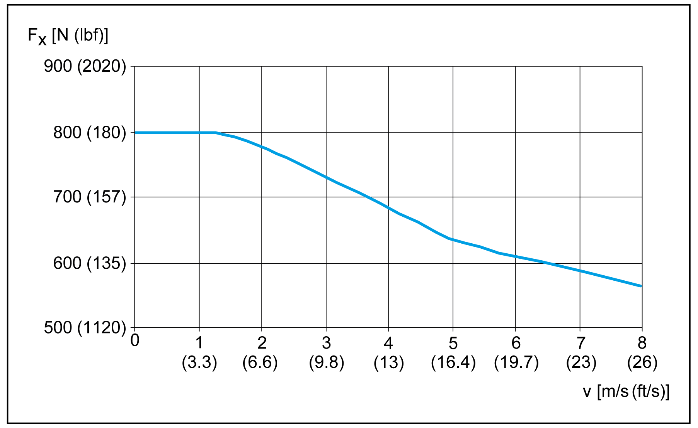

Maximum force Fy

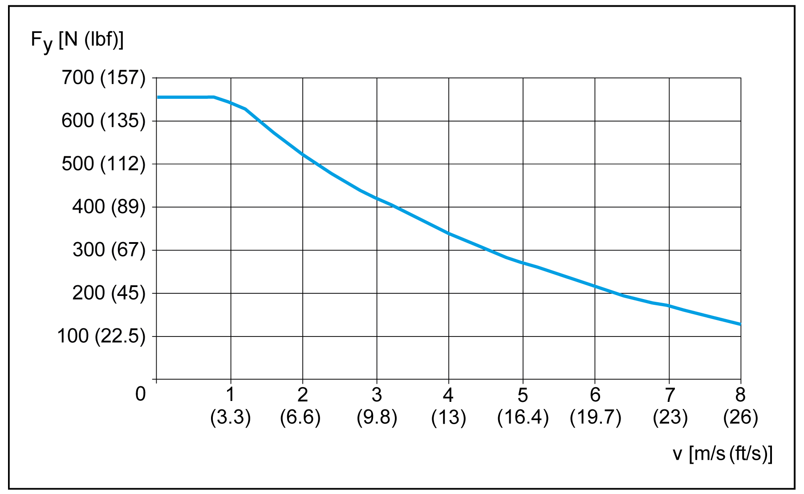

Maximum force Fz

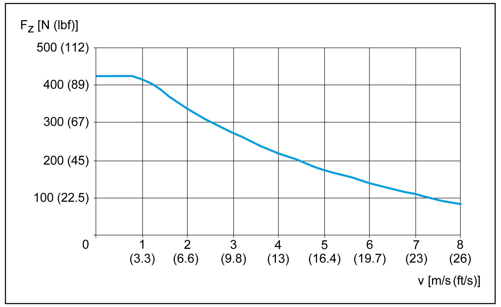

Maximum drive torque Mmax

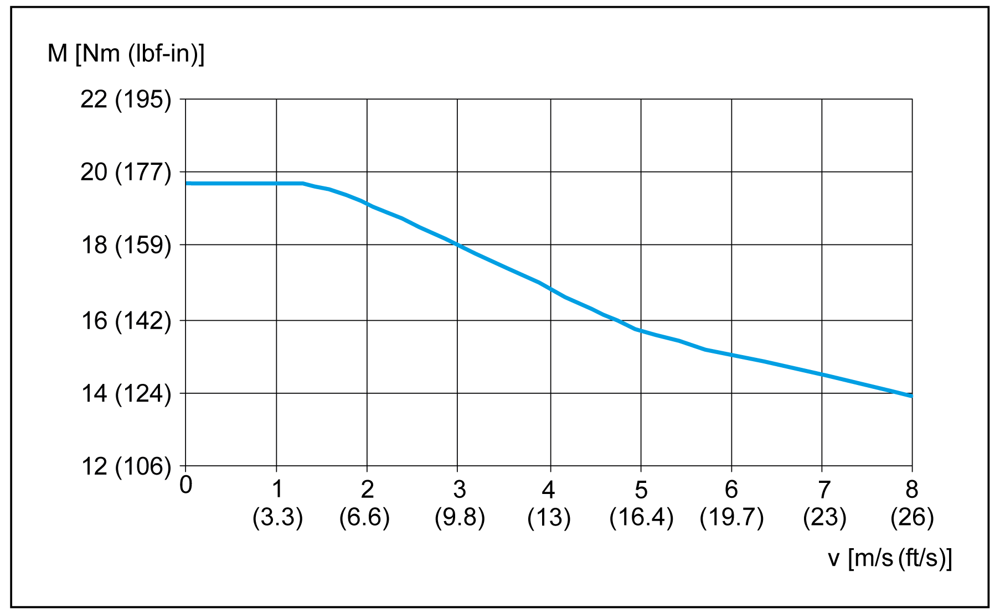

Maximum torque carriage Mx

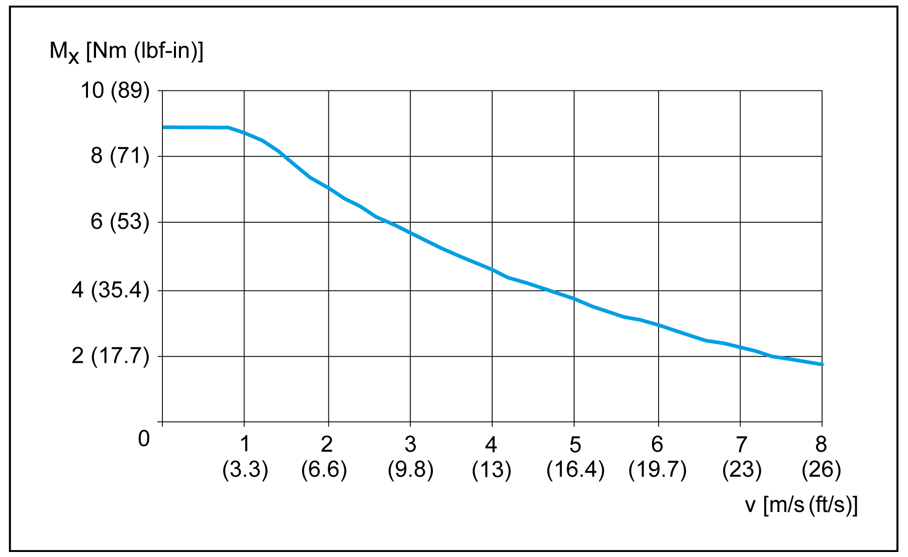

Maximum torque carriage My

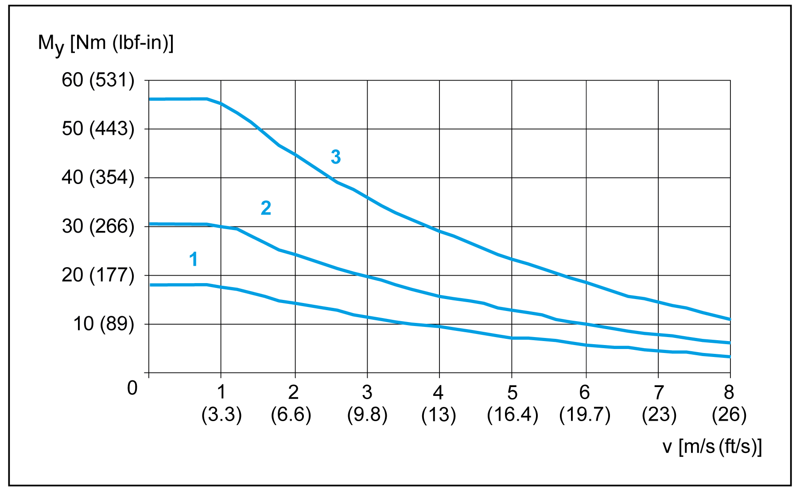

1   Carriage type 1

2   Carriage type 2

3   Carriage type 4

Maximum torque carriage Mz

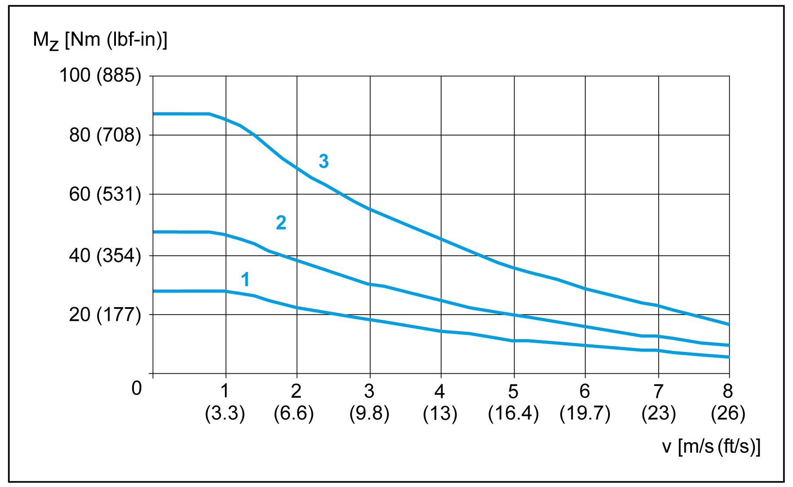

1   Carriage type 1

2   Carriage type 2

3   Carriage type 4

Service life

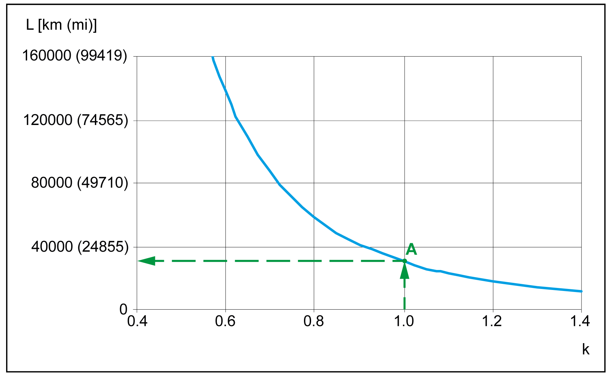

A The forces and torques (Fy, Fz, Mx, Mz, My) are calculated for an expected service life of 30,000 km (18,641 mi). This is shown with k factor equal 1.0 in the graphic.

Maximum deflection

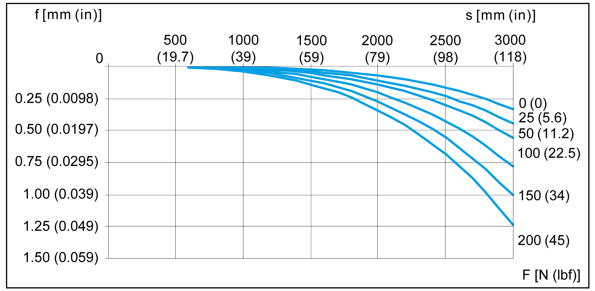

In order to limit deflection of the axis at long strokes, the axis must be supported. The diagram presents the deflection f [mm (in)] of the axis with respect to the support distance S [mm (in)] and the acting force F [N (lbf)]. Excessive deflection reduces the service life of the axis.

NOTE: The graphics presents the deflection of the axis body with firmly clamped supporting points.

Mechanical Data of Lexium PAS42BB

NOTE: The maximum forces and torques are calculated to a service life of 20,000 km (12,427 mi) and can be exceeded. For an application-specific calculation of the service life of the axis, refer to [Service Life](ROBOTICS_Technical_Data-9.htm#XREF_D_SE_0067146_1).

| Parameter | Unit | Value for Lexium PAS42BB | | | | | |
| --- | --- | --- | --- | --- | --- | --- | --- |
| Carriage type 1 | | Carriage type 2 | | Carriage type 4 | |
| without  cover strip | with  cover strip | without  cover strip | with  cover strip | without  cover strip | with  cover strip |
| Toothed belt | – | 25HTD5  width: 25 mm (0.98 in), profile: HTD, pitch: 5 mm (0.197 in) | | | | | |
| Type of guide | – | Recirculating ball bearing guide | | | | | |
| Carriage length | mm  (in) | 206  (8.1) | 303  (12) | 266  (10.5) | 363  (14.3) | 386  (15.2) | 483  (19) |
| Feed constant | mm/rev  (in/rev) | 155  (6.1) | | | | | |
| Effective diameter toothed belt pulley | mm  (in) | 49.338  (1942) | | | | | |
| Maximum feed force Fxmax(1) | N  (lbf) | 800  (180) | | | | | |
| Maximum velocity(2) | m/s  (ft/s) | 5  (16.4) | | | | | |
| Maximum acceleration(2) | m/s2  (ft/s2) | 50  (164) | | | | | |
| Maximum drive torque Mmax(1) | Nm  (lbf–in) | 20  (177) | | | | | |
| Breakaway torque 0-stroke axis | Nm  (lbf–in) | 1.8  (16) | | | | | |
| Breakaway torque per additional carriage | Nm  (lbf–in) | 0.8  (7.1) | | | | | |
| Moment of inertia 0-stroke axis | kg×cm2  (lb×in2) | 8.5  (2.9) | 9.6  (3.3) | 9.5  (3.25) | 10.6  (3.6) | 11.8  (4) | 12.9  (4.4) |
| Moment of inertia per additional carriage | kg×cm2  (lb×in2) | 6.2  (2.1) | 7.3  (2.5) | 7.3  (2.5) | 8.4  (2.87) | 9.6  (3.3) | 10.7  (3.66) |
| Moment of inertia per m (in) of stroke | kg×cm2  (lb×in2) | 1.2  (0.41) | | | | | |
| Moment of inertia per kg (lb) payload | kg×cm2  (lb×in2) | 6.1  (2.1) | | | | | |
| Maximum force Fy(1) | Nm  (lbf–in) | 2810  (28471) | | | | | |
| Maximum force Fz(1) | Nm  (lbf–in) | 2810  (28471) | | | | | |
| Maximum torque carriage Mx(1) | Nm  (lbf–in) | 19  (168) | | | | | |
| Maximum torque carriage My(1) | Nm  (lbf–in) | 74  (655) | | 194  (1717) | | 362  (3204) | |
| Maximum torque carriage Mz(1) | Nm  (lbf–in) | 74  (655) | | 194  (1717) | | 362  (3204) | |
| Mass 0-stroke axis | kg  (lb) | 4.3  (9.5) | 5.2  (11.5) | 4.8  (10.6) | 5.7  (12.6) | 5.8  (12.8) | 6.7  (14.8) |
| Mass per additional carriage (with axis body) | kg  (lb) | 2.2  (4.85) | 2.9  (6.4) | 2.7  (6) | 3.4  (7.5) | 3.7  (8.2) | 4.4  (8.2) |
| Mass per m (in) of stroke | kg  (lb) | 5.6  (12.3) | | | | | |
| Moving mass carriage | kg  (lb) | 1.0  (2.2) | 1.2  (2.65) | 1.2  (2.65) | 1.4  (3.1) | 1.6  (3.5) | 1.8  (4) |
| Maximum stroke(3) | mm  (in) | 5660  (223) | 5540  (218) | 5600  (220) | 5480  (216) | 5480  (216) | 5360  (211) |
| Minimum stroke(4) | mm  (in) | 9  (0.354) | | | | | |
| Position repeatability(2) | mm  (in) | +/- 0.05  (0.00197) | | | | | |
| (1) Maximum permissible forces and torques decrease at increasing velocities. Refer to the characteristic curves following this table.  (2) Depending on load and stroke.  (3) For information about greater strokes, contact your local Schneider Electric representative.  (4) Required for lubrication of the linear guide. | | | | | | | |

Mechanical Data of Lexium PAS42HB

| Parameter | Unit | Value for Lexium PAS42HB | | | | | |
| --- | --- | --- | --- | --- | --- | --- | --- |
| Carriage type 1 | | Carriage type 2 | | Carriage type 4 | |
| without  cover strip | with  cover strip | without  cover strip | with  cover strip | without  cover strip | with  cover strip |
| Breakaway force | N  (lbf) | 30  (6.7) | | | | | |
| Breakaway force per additional carriage | N  (lbf) | 30  (6.7) | | | | | |
| Mass 0-stroke axis | kg  (lb) | 2.8  (6.2) | 3.6  (8) | 3.3  (7.3) | 4.1  (9.1) | 4.3  (9.5) | 5.1  (11.2) |

For further data (if applicable), refer to Lexium PAS42BB.

Characteristic Curves of Lexium PAS42BB

Maximum feed force Fxmax

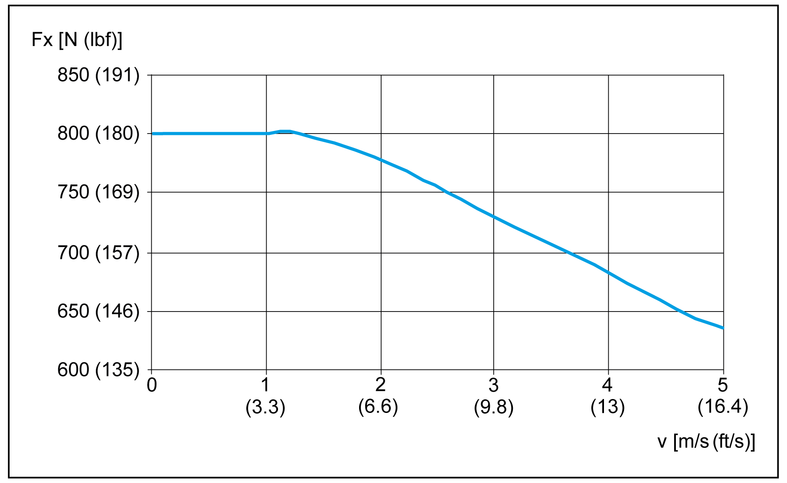

Maximum force Fy

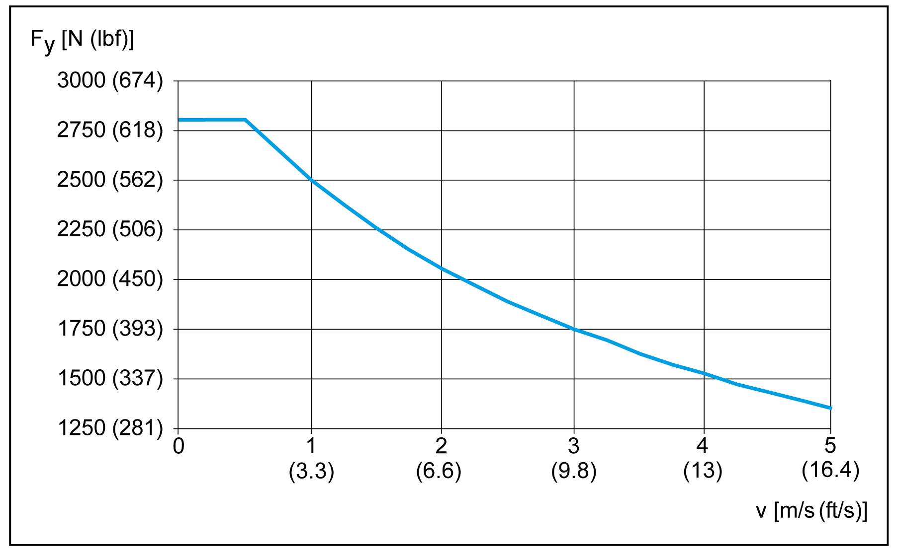

Maximum force Fz

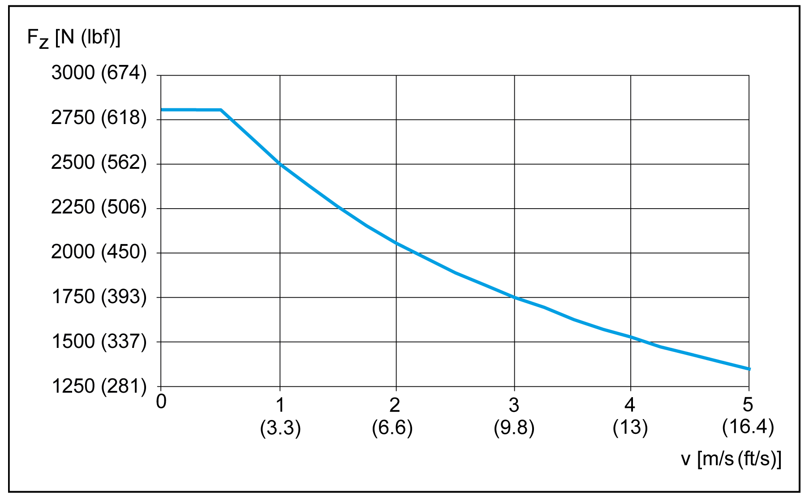

Maximum drive torque Mmax

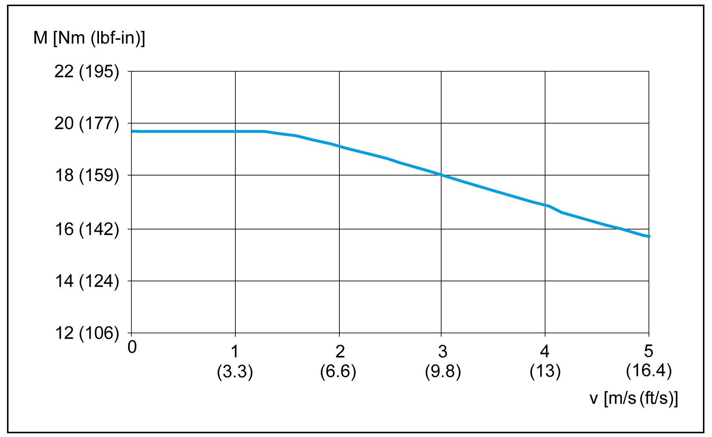

Maximum torque carriage Mx

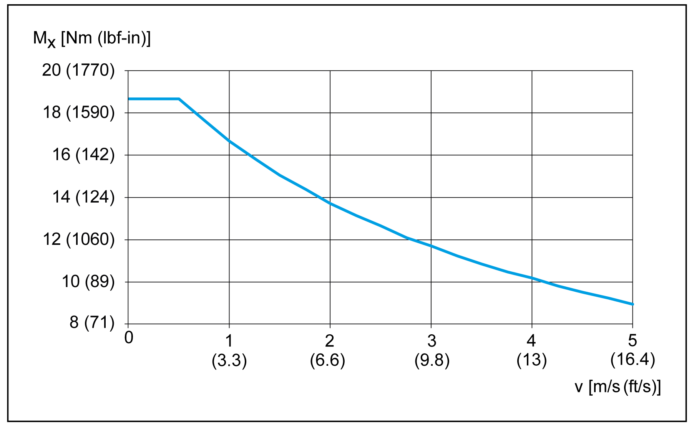

Maximum torque carriage My

1   Carriage type 1

2   Carriage type 2

3   Carriage type 4

Maximum torque carriage Mz

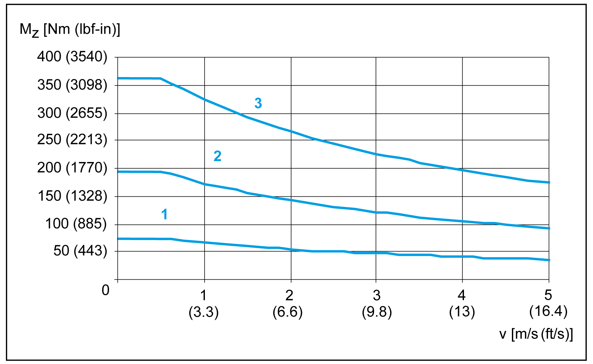

1   Carriage type 1

2   Carriage type 2

3   Carriage type 4

Service life

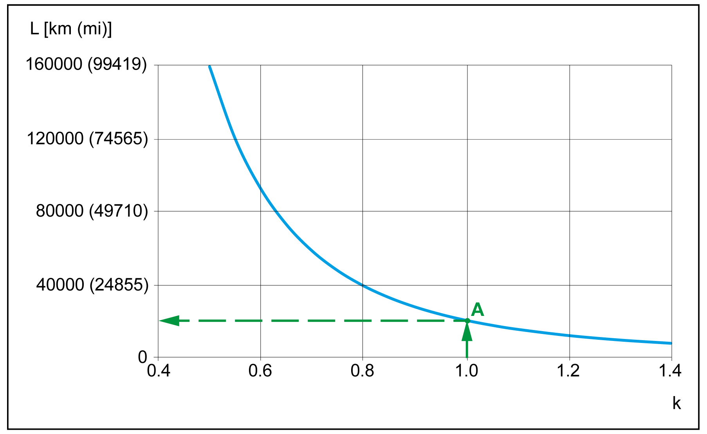

A The forces and torques (Fy, Fz, Mx, Mz, My) are calculated for an expected service life of 20,000 km (12,427 mi). This is shown with k factor equal 1.0 in the graphic.

Maximum deflection

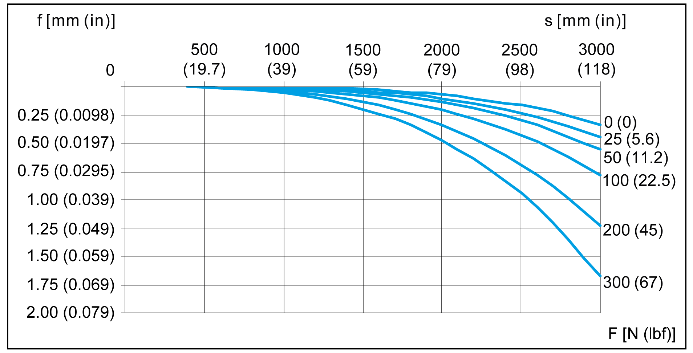

In order to limit deflection of the axis at long strokes, the axis must be supported. The diagram presents the deflection f [mm (in)] of the axis with respect to the support distance S [mm (in)] and the acting force F [N (lbf)]. Excessive deflection reduces the service life of the axis.

NOTE: The graphics presents the deflection of the axis body with firmly clamped supporting points.

Dimensional Drawing of Lexium PAS42B

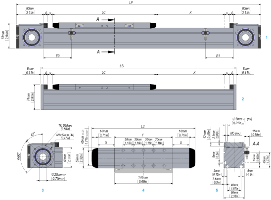

1   Portal axis

2   Support axis

3   End block

4   Carriage type 1 (types 2 and 4 have more tapped holes for mounting)

5   Section of axis

| Parameter | Dim-ension | Unit | Value for Lexium PAS42B and Lexium PAS42H | | | | | |
| --- | --- | --- | --- | --- | --- | --- | --- | --- |
| Carriage type 1 | | Carriage type 2 | | Carriage type 4 | |
| without  cover strip | with  cover strip | without  cover strip | with  cover strip | without  cover strip | with  cover strip |
| Total length of portal axis(1) | LP | mm  (in) | 396 + X  (15.6 + X) | 516 + X  (20.3 + X) | 456 + X  (18 + X) | 576 + X  (22.7 + X) | 576 + X  (22.7 + X) | 696 + X  (27.4 + X) |
| Total length of support axis | LS | mm  (in) | 252 + X  (10 + X) | 372 + X  (14.6 + X) | 312 + X  (12.3 + X) | 432 + X  (17 + X) | 432 + X  (17 + X) | 552 + X  (21.7 + X) |
| Stroke | X | – | See technical data | | | | | |
| Carriage length | LC | mm  (in) | 206  (8.1) | 303  (12) | 266  (10.5) | 363  (14.3) | 386  (15.2) | 483  (19) |
| Profile length of carriage | F | mm  (in) | 170  (6.7) | | 230  (9) | | 350  (13.8) | |
| Number of tapped holes for mounting(2) | n | – | 10 | | 14 | | 22 | |
| Distance between tapped holes |  | mm  (in) | 30 +/- 0.03  (1.18 +/- 0.00118) | | 30 +/- 0.03  (1.18 +/- 0.00118) | | 30 +/- 0.03  (1.18 +/- 0.00118) | |
| Sensor position at drive end | E0 | mm  (in) | 33  (1.3) | 93  (3.66) | 33  (1.3) | 93  (3.66) | 33  (1.3) | 93  (3.66) |
| Sensor position opposite drive end | E1 | mm  (in) | 33  (1.3) | 93  (3.66) | 93  (3.66) | 153  (6) | 213  (8.4) | 273  (10.7) |
| Stroke reserve up to mechanical stop | c | mm  (in) | 15  (0.59) | | | | | |
| Length of cover strip clamp | d | mm  (in) | – | 11.5  (0.45) | – | 11.5  (0.45) | – | 11.5  (0.45) |
| Deflection of cover strip | D | mm  (in) | – | 48.5  (1.9) | – | 48.5  (1.9) | – | 48.5  (1.9) |
| Minimum distance between two carriages | – | mm  (in) | 40  (1.57) | 90  (3.54) | 40  (1.57) | 90  (3.54) | 40  (1.57) | 90  (3.54) |
| (1) For a axis with more than one carriage, add the carriage length (LC) and the distance between the carriages for each additional carriage.  (2) Prepared for locating dowels. For suitable locating dowels, refer to [Replacement Equipment](../ROBOTICS_Replacement_Equipment/ROBOTICS_Replacement_Equipment-3.htm#XREF_D_SE_0086180_1). | | | | | | | | |

EIO0000003627.00

© 2018 Schneider Electric. All rights reserved.