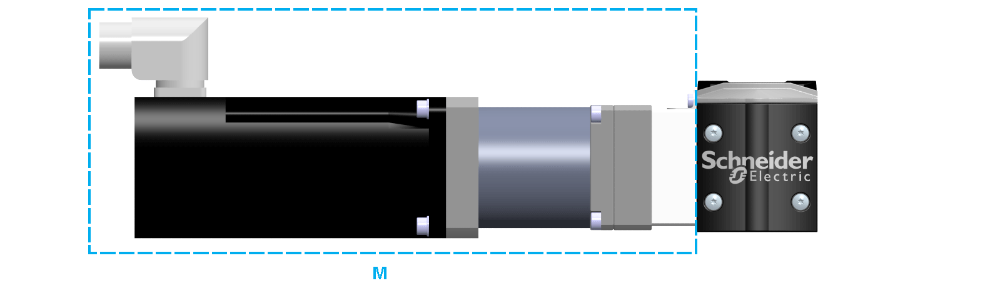
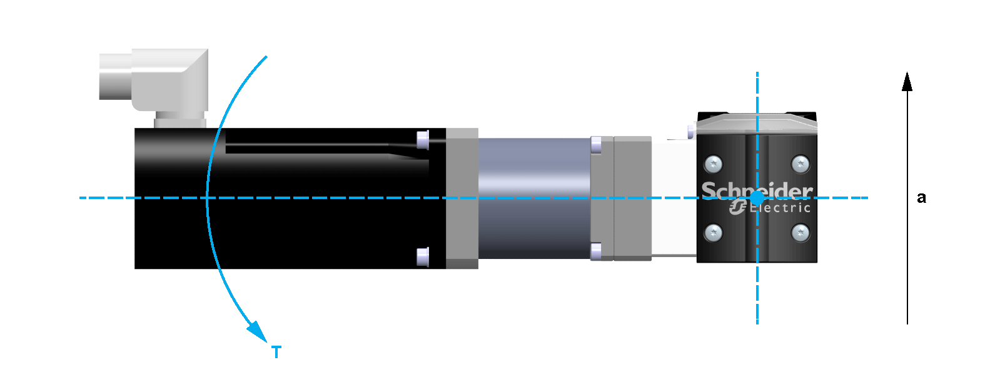

# Mounting the Motor and/or Gearbox

Mounting the Motor and/or Gearbox

Overview

Optionally, the axis is supplied with a pre-installed Schneider Electric motor and/or a gearbox.

Mounting Position of Motor and Gearbox

In case of a new motor or gearbox, you can mount the new motor or gearbox to either side of the two end blocks. The motor and the gearbox can be mounted in different arrangements (turned in increments of 4 x 90°). For further information, refer to [Motor and/or Gearbox Orientation and Configuration](../ROBOTICS_System_Overview/ROBOTICS_System_Overview-4.htm#XREF_D_SE_0061606_4).

NOTE: The maximum mass of the installed parts is limited by the torque at the end block.

Maximum Mass

The mass of the motor and/or gearbox which can be mounted to the end block is limited.

M   Mass at end block

The maximum mass of a motor and/or gearbox which can be mounted to the end block depends on the size of the corresponding axis. The following table presents the maximum permissible masses of a mounted motor and/or gearbox:

| Parameter | Unit | Value | | | |
| --- | --- | --- | --- | --- | --- |
| PAS41B | PAS42B | PAS43B | PAS44B |
| Maximum permissible mass | kg (lb) | 4 (8.8) | 15 (33) | 25 (44) | 40 (88) |

|  |
| --- |
| Warning_Color.gifWARNING |
| UNINTENDED EQUIPMENT OPERATION |
| Do not exceed the maximum permissible mass at the end block. |
| Failure to follow these instructions can result in death, serious injury, or equipment damage. |

Maximum Torque

A mounted motor and/or gearbox causes a static overturning torque at the end block. In case of a lateral acceleration of the complete axis, the mounted motor and/or gearbox cause an additional dynamic overturning torque. The total of the static and dynamic overturning torque is limited by the maximum overturning torque of the end block

T   Torque at the end block

a   Lateral acceleration of the axis

The following table presents the maximum permissible torques of the mounted motor and/or gearbox at the end block:

| Parameter | Unit | Value | | | |
| --- | --- | --- | --- | --- | --- |
| PAS41B | PAS42B | PAS43B | PAS44B |
| Maximum permissible torque (total of static and dynamic) | Nm (lbf-in) | 14 (124) | 85 (752) | 170 (1505) | 360 (3186) |

NOTE: The total of the static and dynamic torques must not exceed the maximum permissible torque at the end block.

|  |
| --- |
| Warning_Color.gifWARNING |
| UNINTENDED EQUIPMENT OPERATION |
| Do not exceed the maximum permissible torque at the end block. |
| Failure to follow these instructions can result in death, serious injury, or equipment damage. |

Third-Party Motors and Gearboxes

When choosing a third-party motor, take special care that the maximum drive torque is not exceeded. Otherwise the axis could be damaged or rendered inoperable.

|  |
| --- |
| Warning_Color.gifWARNING |
| UNINTENDED MOVEMENTS |
| Observe the maximum permissible drive torque of the corresponding motor. |
| Failure to follow these instructions can result in death, serious injury, or equipment damage. |

|  |
| --- |
| Warning_Color.gifWARNING |
| FALLING HEAVY LOAD |
| Observe the limitations for the maximum permissible mass and the maximum permissible torque of the mounted motor and/or gearbox. |
| Failure to follow these instructions can result in death, serious injury, or equipment damage. |

Coupling Assemblies for Motor and Gearbox Mounting

A coupling assembly is required to mount a motor or a gearbox to the axis. It consists of the following components:

1   Expanding hub

2   Elastomer spider

3   Clamping hub

Prerequisites

You need the following tools to mount the motor and/or the gearbox:

oTorque wrench with a set of hexagon sockets

oCaliper gauge (for distance measurement)

NOTE: Do not use ball head hex keys. Excessive torque may cause the ball head to break away. A broken ball head makes the removal of the screw difficult.

For suitable parts, refer to [Replacement Equipment and Accessories](../ROBOTICS_Replacement_Equipment/ROBOTICS_Replacement_Equipment-1.htm#XREF_D_SE_0065517_1).

Procedure Overview

Perform the following procedures to mount the motor and/or the gearbox:

o[Preparing the mounting of motor and gearbox](#XREF_D_SE_0061741_6)

o[Mounting the elastomer coupling](#XREF_D_SE_0061741_7)

o[Mounting the motor only](#XREF_D_SE_0061741_8)

o[Mounting the gearbox only](#XREF_D_SE_0061741_9)

o[Mounting the motor to the gearbox](#XREF_D_SE_0061741_16)

Preparing the Mounting of Motor and Gearbox

| Step | Action |
| --- | --- |
| 1 | Clean all parts. |
| 2 | Inspect all parts for damage. |

NOTE: Polluted or damaged parts may cause run-out which has an adverse effect on the service life of the axis.

|  |
| --- |
| NOTICE |
| UNINTENDED EQUIPMENT OPERATION |
| oReplace any damaged parts immediately.  oClean all parts before assembly and use. |
| Failure to follow these instructions can result in equipment damage. |

Mounting the Elastomer Coupling

| Step | Action |
| --- | --- |
| 1 | Manually move the carriage (1) into end position.  G-SE-0054316.2.gif-high.gif |
| 2 | Fit the expanding hub (3) into the hollow shaft of the toothed belt pulley (2). Verify that there is no clearance between the expanding hub and the toothed belt pulley such that the surfaces are flush. |
| 3 | Tighten the screw (4) of the expanding hub.  Tightening torque:  oFor PAS41: 2.9 Nm (25.7 lbf-in)  oFor PAS42: 10 Nm (89 lbf-in)  oFor PAS43: 25 Nm (221 lbf-in)  oFor PAS44: 49 Nm (434 lbf-in)  NOTE: As long as the toothed belt is installed correctly and the carriage is at the end position, the toothed belt pulley does not rotate further. For detailed information about toothed belt installation, refer to [Mounting the Toothed Belt](../ROBOTICS_Maintenance_and_Repair/ROBOTICS_Maintenance_and_Repair-18.htm#XREF_D_SE_0061823_12). |
| 4 | Fit the elastomer spider (5) into the expanding hub.  G-SE-0056579.1.gif-high.gif      NOTE:  oIf the elastomer spider can be inserted too easily (without preloading), it must be replaced.  oSlightly greasing the elastomer spider facilitates the fitting process. Use only mineral oilbased lubricants without additives or silicon-based lubricants. |
| 5 | Fasten the coupling housing (7) to the end block (6) with the four screws (8). Use the [standard tightening torque](../ROBOTICS_Transport_and_Comissioning/ROBOTICS_Transport_and_Comissioning-6.htm#XREF_D_SE_0088555_4). Verify that there is no clearance between the coupling housing and the end block such that the surfaces are flush.  G-SE-0056580.2.gif-high.gif      NOTE: Greasing every centering collar provides easier dismounting. Use only mineral oil-based lubricants without additives or silicon-based lubricants. |
| 6 | Fit the clamping hub (10) into the elastomer spider.  G-SE-0056581.1.gif-high.gif |
| 7 | Verify that the orientation of the clamping screw (9) is the same as the orientation of the motor or gearbox. For further information, refer to [Motor and/or Gearbox Orientation and Configuration](../ROBOTICS_System_Overview/ROBOTICS_System_Overview-4.htm#XREF_D_SE_0061606_4). |
| 8 | Verify the dimension d of the clamping hub. Measure the dimension from the top of the clamping hub to the collar of the coupling housing.  Dimension d:  oFor PAS41: 8 mm (0.315 in)  oFor PAS42: 13 mm (0.51 in)  oFor PAS43 / PAS44: 14 mm (0.55 in)  G-SE-0072710.1.gif-high.gif |

Mounting the Motor Only

| Step | Action |
| --- | --- |
| 1 | Fasten the motor adapter plate (2) to the coupling housing (3) with the four screws (1). Use the [standard tightening torque](../ROBOTICS_Transport_and_Comissioning/ROBOTICS_Transport_and_Comissioning-6.htm#XREF_D_SE_0088555_4).  Verify that:  oThere is no clearance between the motor adapter plate and the coupling housing such that the surfaces are flush.  oThe orientation is the same as the orientation of the motor or gearbox. For further information, refer to [Motor and/or Gearbox Orientation and Configuration](../ROBOTICS_System_Overview/ROBOTICS_System_Overview-4.htm#XREF_D_SE_0061606_4).  G-SE-0056582.1.gif-high.gif      NOTE: Greasing every centering collar provides easier dismounting. Use only mineral oil-based lubricants without additives or silicon-based lubricants. |
| 2 | Fit the motor (4) into the clamping hub (7) and to the motor adapter plate and secure the motor from falling. Verify that there is no clearance between the motor and the motor adapter plate such that the surfaces are flush.  G-SE-0054310.1.gif-high.gif      NOTE: Greasing every centering collar provides easier dismounting. Use only mineral oil-based lubricants without additives or silicon-based lubricants. |
| 3 | Fasten the motor with the four screws (5) and washers (6). Use the [standard tightening torque](../ROBOTICS_Transport_and_Comissioning/ROBOTICS_Transport_and_Comissioning-6.htm#XREF_D_SE_0088555_4). |
| 4 | Remove the setscrew (8) at the motor adapter plate.  G-SE-0054311.1.gif-high.gif |
| 5 | Tighten the screw of the clamping hub through the hole.  Tightening torque:  oFor PAS41: 1.9 Nm (16.8 lbf-in)  oFor PAS42 / PAS43: 14 Nm (124 lbf-in)  oFor PAS44: 35 Nm (310 lbf-in) |
| 6 | Insert the setscrew into the motor adapter plate and tighten it.  Tightening torque: 4 Nm (35.4 lbf-in) |

Mounting the Gearbox Only

| Step | Action |
| --- | --- |
| 1 | Fasten the motor adapter plate (2) to the coupling housing (3) with the four screws (1). Use the [standard tightening torque](../ROBOTICS_Transport_and_Comissioning/ROBOTICS_Transport_and_Comissioning-6.htm#XREF_D_SE_0088555_4).  Verify that:  oThere is no clearance between the motor adapter plate and the coupling housing such that the surfaces are flush.  oThe standard orientation of the setcrews is upwards. For further information, refer to [Motor and/or Gearbox Orientation and Configuration](../ROBOTICS_System_Overview/ROBOTICS_System_Overview-4.htm#XREF_D_SE_0061606_4).  G-SE-0056582.1.gif-high.gif |
| 2 | Fasten the flange plate (5) to the gearbox (4) with the four screws (6). Use the [standard tightening torque](../ROBOTICS_Transport_and_Comissioning/ROBOTICS_Transport_and_Comissioning-6.htm#XREF_D_SE_0088555_4). Verify that there is no clearance between the flange plate and the gearbox such that the surfaces are flush.  G-SE-0054308.2.gif-high.gif      NOTE: Greasing every centering collar provides easier dismounting. Use only mineral oil-based lubricants without additives or silicon-based lubricants. |
| 3 | Fit the flange plate complete with gearbox into the clamping hub (7) and to the motor adapter plate and secure the gearbox from falling. Verify that there is no clearance between the motor and the motor adapter plate such that the surfaces are flush.  G-SE-0056576.1.gif-high.gif      NOTE: Greasing every centering collar provides easier dismounting. Use only mineral oil-based lubricants without additives or silicon-based lubricants. |
| 4 | Fasten the flange plate complete with gearbox with the four screws (8). Use the [standard tightening torque](../ROBOTICS_Transport_and_Comissioning/ROBOTICS_Transport_and_Comissioning-6.htm#XREF_D_SE_0088555_4). |
| 5 | Remove the setscrew (9) at the motor adapter plate.  G-SE-0054309.1.gif-high.gif |
| 6 | Tighten the screw of the clamping hub through the hole.  Tightening torque:  oFor PAS41: 1.9 Nm (16.8 lbf-in)  oFor PAS42 / PAS43: 14 Nm (124 lbf-in)  oFor PAS44: 35 Nm (310 lbf-in) |
| 7 | Insert the setscrew into the motor adapter plate and tighten the setscrew.  Tightening torque: 4 Nm (35.4 lbf-in) |

Mounting the Motor to the Gearbox

|  |
| --- |
| NOTICE |
| DISTORTION OF MOTOR AND GEARBOX |
| Only fasten motor and gearbox with all components at the same ambient temperature. |
| Failure to follow these instructions can result in equipment damage. |

NOTE: If possible, fasten the motor to the gearbox in vertical position for easier mounting.

For more information about installing the motor to the gearbox, refer to the corresponding gearbox manual.

EIO0000003627.00

© 2018 Schneider Electric. All rights reserved.