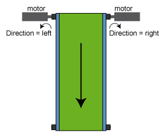

# Functional Description

Functional Description

Is used to enter the direction of motion. With this the direction of motion can be adjusted to the load. For rotary drives, the direction of rotation is indicated in the event of positive velocity (view on the drive shaft) and corresponding to EncoderPosition.

For linear drives, the direction of movement is indicated corresponding to [EncoderPosition](../RefActualValues/RefActualValues-7.htm#XREF_D_SE_0071802_1).

The parameter Direction responds to the reference positions, actual positions, reference velocities, actual velocities, currents, and the reference acceleration. It has no influence on the EncoderPosition.

| Value | Data type | Meaning for rotary drives | Meaning for rotary and linear drives |
| --- | --- | --- | --- |
| left / 0 | BOOL | View on the drive shaft by positive velocity:  In counterclockwise direction | MechPosition and EncoderPosition develop in opposite direction. |
| right / 1 | BOOL | View on the drive shaft by positive velocity:  Clockwise (standard value) | MechPosition and EncoderPosition develop in equal direction. |

Direction parameter using the example of rotary drives

If right / 1 is parameterized, then the MechPosition and the EncoderPosition initially have the same positive values after the Sercos phase up.

If left / 0 is parameterized, then the MechPosition and the EncoderPosition initially have the same amount but different signs after the Sercos phase up. The EncoderPosition is positive and the MechPosition negative.

NOTE: Modifications to the parameter are only applied during the Sercos phase up (communication phase 0 => communication phase 4).