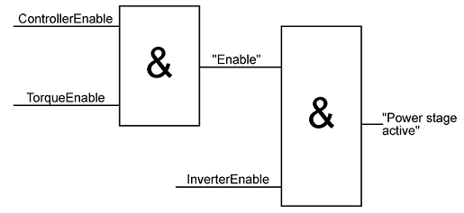

# TorqueEnable

TorqueEnable

General

|  |  |
| --- | --- |
| Type | EF |
| Offline editable | No |
| Devices supporting the parameter | Lexium LXM52 Drive, Lexium LXM52 Linear Drive,  Lexium LXM62 Drive, Lexium LXM62 Linear Drive,  Lexium ILM62 Drive Module,  Sercos Drive |
| Traceable | Yes |

Functional Description

Enabling the torque for the drive. If TorqueEnable is set to FALSE during the operation (AxisState > 2), then the [Reaction AD](../../../../../../api/crossBook?lang=en-US&virtualBookName=PD.Diagnostic&topicID=D_SE_0063389_1) is triggered.

The following figure shows the influence of ControllerEnable, TorqueEnable, and InverterEnable on the power stage release of the servo amplifier.

EIO0000003557.00

© 2018 Schneider Electric. All rights reserved.