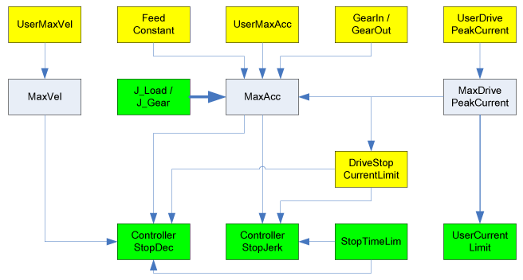

# MaxDrivePeakCurrent

MaxDrivePeakCurrent

General

|  |  |
| --- | --- |
| Type | AK |
| Devices supporting the parameter | Lexium LXM52 Drive, Lexium LXM52 Linear Drive,  Lexium LXM62 Drive, Lexium LXM62 Linear Drive,  Lexium ILM62 Drive Module,  Sercos Drive |
| Traceable | No |

Functional Description

Displays the maximum drive current (combination of servo amplifier / motor). This current can be reduced via the parameters [UserDrivePeakCurrent](../../../../../../api/crossBook?lang=en-US&virtualBookName=PD.Parameter.LXM52Drive&topicID=D_SE_0071529_1), [UserCurrentLimit](../../../../../../api/crossBook?lang=en-US&virtualBookName=PD.Parameter.LXM52LinearDrive&topicID=D_SE_0071530_1), and DriveStopCurrentLimit.

Changes of UserDrivePeakCurrent are taken over by the Sercos phase up in MaxDrive­PeakCurrent. Changes on UserCurrentLimit or DriveStopCurrentLimit have no effect on the parameter MaxDrivePeakCurrent.

NOTE: The parameter value is transferred from the slave to the master via the parameter channel of the Sercos by every access. Typically, this takes about 10 ms. By a high capacity of the parameter channel, times up to 1 s can occur. If the Sercos bus is in phase 0 or 1, then a standard value is indicated here. If the Sercos bus is in phase 3 or 4, then the parameter value is transferred and indicated. In the Sercos phase 2, the parameter can be read through the application.

The following graphic shows the dependency with other object parameters for rotary drives:

The following graphic shows the dependency with other object parameters for linear drives:

Yellow parameters are input parameters, whose values are taken over by the Sercos phase up. Green parameters are input parameters, whose values are taken over immediately. Gray parameters are output parameters. Thick arrows show that a parameter makes an impact on another parameter immediately by the input. Thin arrows show that a parameter does not have an impact until the next Sercos phase up or when the dependent parameter is entered. The arrow indicates the effective direction of the dependency.

Example:

Entering J\_Load has a direct impact on the parameter MaxAcc. A revision of MaxAcc only has an impact on ControllerStopDec if,

oa Sercos phase up takes place or

othe parameter ControllerStopDec is modified.

EIO0000003557.00

© 2018 Schneider Electric. All rights reserved.