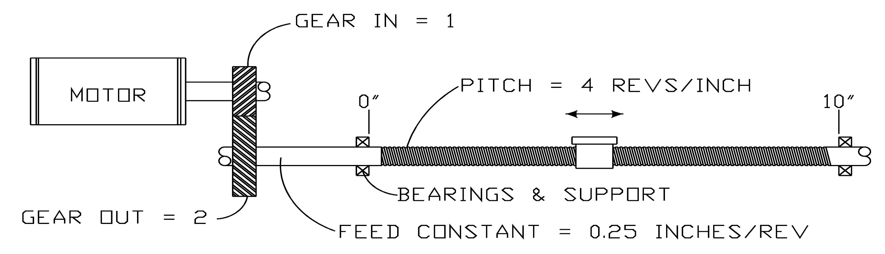

# Examples

Examples

oIf a toothed belt covers, for example, 120 mm per drive shaft revolution, then 120 is entered in the FeedConstant. One unit thus is one mm.

oIf a disc covers, for example, 360 degrees per drive shaft revolution, then 360 is entered in the FeedConstant. One unit is one degree.

The following example for an installation shows how the parameters FeedConstant, GearIn, and GearOut are to be defined.

Example installation for the parameters FeedConstant, GearIn, GearOut

The ball screw spindle has a thread pitch of 0.25 inch per drive shaft revolution. The FeedConstant is therefore 0.25 and defines the units as inches.

The units for velocity and acceleration are thus inches/s and inches/s2.

The units for position, velocity, and acceleration are defined by the following parameters:

oFeedConstant = 0.25

oGearIn = 1

oGearOut = 2

The following graphic shows the dependency with other object parameters for rotary drives:

Yellow parameters are input parameters, whose values are taken over by the Sercos phase up. Green parameters are input parameters, whose values are taken over immediately. Gray parameters are output parameters. Thick arrows show that a parameter makes an impact on another parameter immediately by the input. Thin arrows show that a parameter does not have an impact until the next Sercos phase up or when the dependent parameter is entered. The arrow indicates the effective direction of the dependency.

Example:

Entering J\_Load has a direct impact on the parameter MaxAcc. A revision of MaxAcc only has an impact on ControllerStopDec if,

oa Sercos phase up takes place or

othe parameter ControllerStopDec is modified.