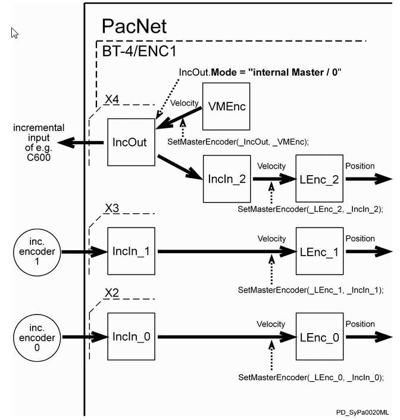
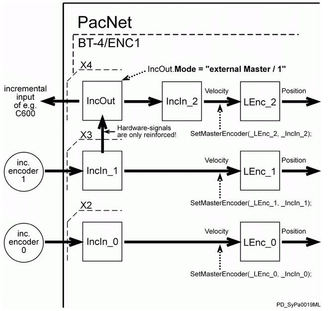
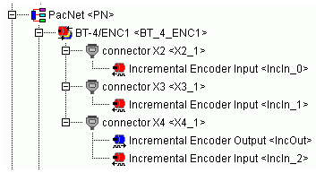

# Functional Description

Functional Description

Sets the mode of the incremental encoder output. The mode can be dynamically modified.

| Value | Meaning |
| --- | --- |
| internal Master / 0 | Any master encoder can be registered as a velocity source. You can link a master encoder to an incremental encoder output using the FC\_SetMasterEncoder() function. If an incremental encoder input is also configured on connector X4, encoder output signals are returned over it. The incremental encoder input on connector X4 cannot be used as a physical encoder input in this case because the connector is physically engaged by the encoder output. |
| external master / 1 | The signals from the incremental encoder input on connector X3 are issued directly at the incremental encoder output on the X4 connector. This coupling transmits the hardware signals without a delay. [InObject](IncrementalEncoderOutput-5.htm#XREF_D_SE_0076269_1) displays the name of the incremental encoder input that is on connector X3 (if this incremental encoder input is configured on connector X3). |

NOTE: For external Master, it is not necessary to configure the incremental encoder input that is on connector X3. The incremental encoder input must be configured if you want to access the incremental encoder input parameters. Any master encoder previously coupled with the incremental encoder output using FC\_SetMasterEncoder() gets logged off.

NOTE: The parameters [Direction](IncrementalEncoderOutput-9.htm#XREF_D_SE_0076273_1), [Resolution](../MasterEnc_Incremental/MasterEnc_Incremental-6.htm#XREF_D_SE_0075934_1), and [FeedConstant](IncrementalEncoderOutput-7.htm#XREF_D_SE_0076271_1) do not affect output signals. They only affect parameters in the PLC configuration.

Internal Master / 0

External Master / 1

PLC configuration for BT-4/ENC1 with three incremental encoder inputs and one incremental encoder output

