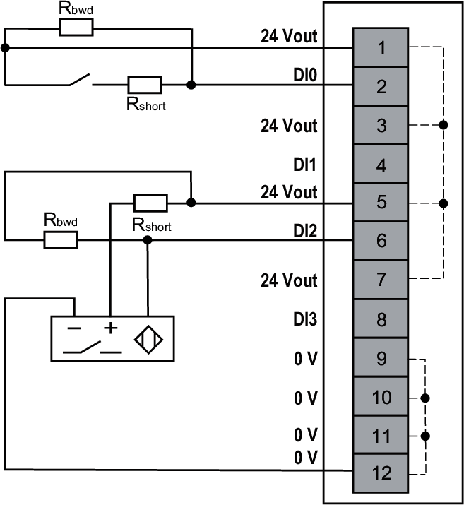
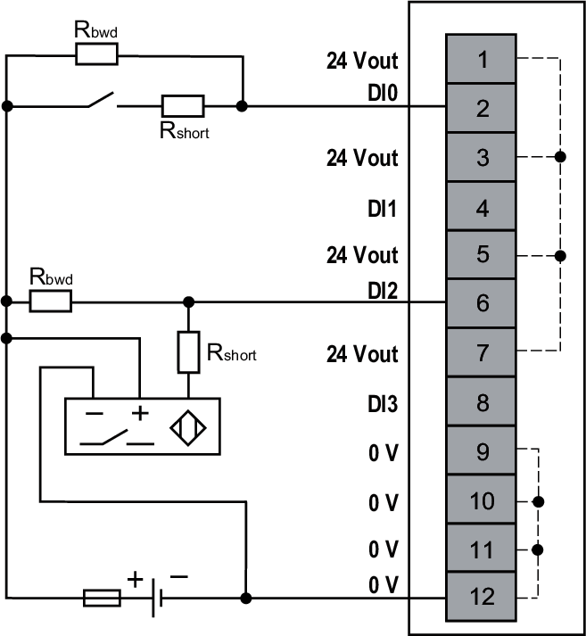

# Wiring Diagrams

This module allows the use of an external power supply to energize the sensors.

| WARNING | |
| --- | --- |
|  | UNINTENDED EQUIPMENT OPERATION  Use the sensor and actuator power supply only for supplying power to sensors or actuators connected to the module.  Failure to follow these instructions can result in death, serious injury, or equipment damage. |

## Wiring Using the Internal Power Supply

The following figure illustrates an example of 2-/3-wire connection sink inputs with the internal power supply:

**Rbwd** (required when broken wire detection is enabled):  
39 kΩ 1/16 W, 1%  
**Rshort** (required when short circuit detection is enabled):  
3.3 kΩ 1/4 W, 1%

## Wiring Using an External Power Supply

The following figure illustrates an example of 2-/3-wire connection sink inputs with an external power supply:

**External Fuse**: Type F, 0.1 A, 24 Vdc is mandatory and must be chosen in compliance with IEC60269 standard.  
**Rbwd** (required when broken wire detection is enabled):  
39 kΩ 1/16 W, 1%  
**Rshort** (required when short circuit detection is enabled):  
3.3 kΩ 1/4 W, 1%

EIO0000005238.02