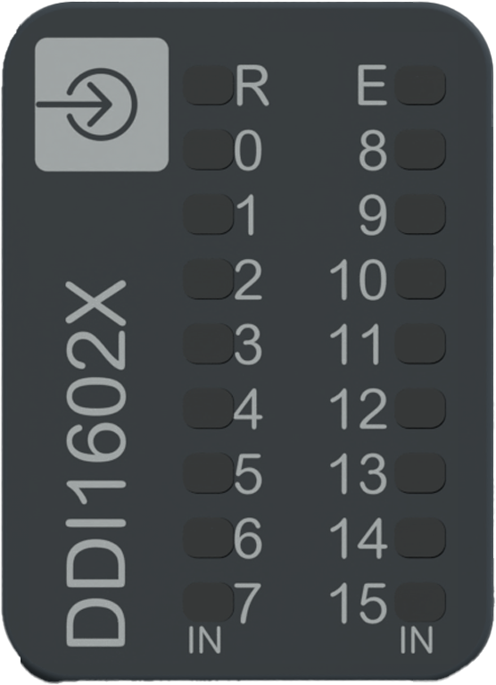

# Status LEDs

The following figure presents the NTSDDI1602X/NTSDDI1602XH status LEDs:

The following table describes the status of LEDs:

| R (Green) | E (Red) | IN0...15 (Green) | Description |
| --- | --- | --- | --- |
| **Initialization and non-operational states** | | | |
| OFF | OFF | OFF | Indicates that the module is not energized. |
| OFF | Fast Flash | - | Indicates that the module has detected a system error. |
| Regular Flash | OFF | - | Indicates that the firmware is being updated. |
| Regular Flash | ON | - | Indicates that a module mismatch is detected. |
| Single Flash | OFF | - | Indicates that the module is energized and not configured. |
| **Operational state** | | | |
| ON | OFF | - | Indicates that the module is energized, configured and operational. |
| ON | - | ON | Indicates that the corresponding input channel is activated. |
| ON | - | OFF | Indicates that the corresponding input channel is deactivated. |
| ON | Regular Flash | OFF | Indicates one of the following:  * 24 Vdc field power error detection. * Sensor power supply error detection. |

The following graphic depicts the system status of LEDs during module operation:

EIO0000005238.02