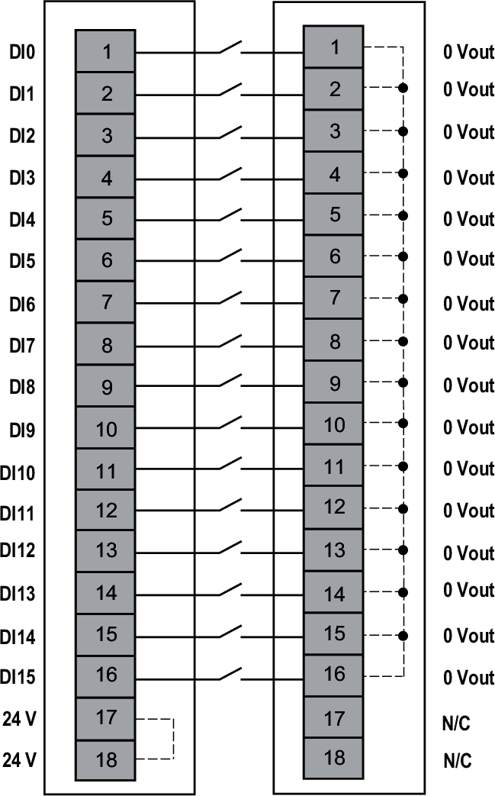
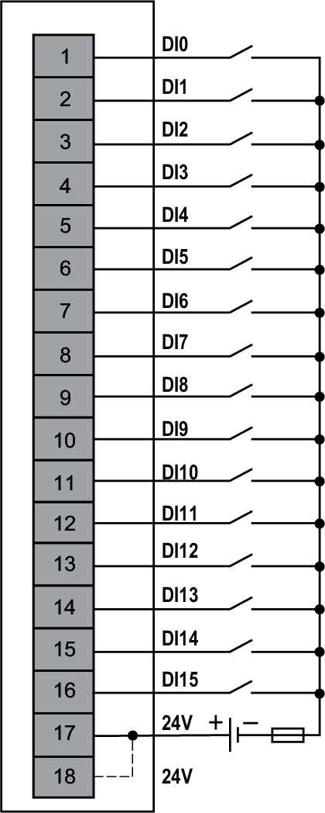

# Wiring Diagrams

This module allows the use of an external power supply to energize the sensors.

| WARNING | |
| --- | --- |
|  | UNINTENDED EQUIPMENT OPERATION  Use the sensor and actuator power supply only for supplying power to sensors or actuators connected to the module.  Failure to follow these instructions can result in death, serious injury, or equipment damage. |

The following figure illustrates an example of 1-wire connection inputs with a common module NTSPCM1600H:

**N/C**: No Connection

| WARNING | |
| --- | --- |
|  | UNINTENDED EQUIPMENT OPERATION  Do not connect wires to unused terminals and/or terminals indicated as “No Connection (N/C)”.  Failure to follow these instructions can result in death, serious injury, or equipment damage. |

The following figure illustrates an example of 1-wire connection inputs with an external power supply:

**External Fuse**: Type F, 0.5 A, 24 Vdc is mandatory and must be chosen in compliance with IEC60269 standard.

EIO0000005238.02