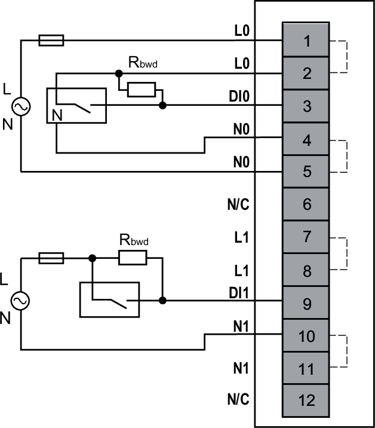
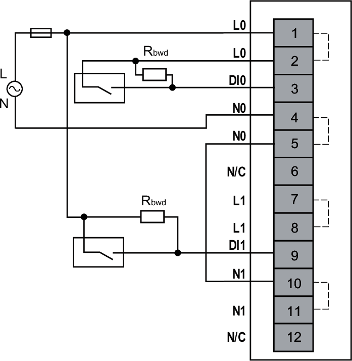

# Wiring Diagrams

Each input channel requires an external 120...230 Vac power supply.

To maintain the isolation between channels, use 2 independent power supplies.

| WARNING | |
| --- | --- |
|  | UNINTENDED EQUIPMENT OPERATION  Use the sensor and actuator power supply only for supplying power to sensors or actuators connected to the module.  Failure to follow these instructions can result in death, serious injury, or equipment damage. |

The following figure illustrates an example, with isolation between channels, of a 3-wire connection input with power supply monitoring and a 2-wire connection input without power supply monitoring:

**N/C**: No Connection  
**Rbwd** (required when broken wire detection is enabled): 200 kΩ, 1 W, 10%  
**External Fuse**: Type F, 0.5 A, 230 Vac is mandatory and must be chosen in compliance with IEC60269 standard.

| WARNING | |
| --- | --- |
|  | UNINTENDED EQUIPMENT OPERATION  Do not connect wires to unused terminals and/or terminals indicated as “No Connection (N/C)”.  Failure to follow these instructions can result in death, serious injury, or equipment damage. |

The following figure illustrates an example, without isolation between channels, of a 2-wire connection input with power supply monitoring and a 1-wire connection input without power supply monitoring:

**N/C**: No Connection  
**Rbwd** (required when broken wire detection is enabled): 200 kΩ 1 W, 10%  
**External Fuse**: Type F, 0.5 A, 230 Vac is mandatory and must be chosen in compliance with IEC60269 standard.

| WARNING | |
| --- | --- |
|  | UNINTENDED EQUIPMENT OPERATION  Do not connect wires to unused terminals and/or terminals indicated as “No Connection (N/C)”.  Failure to follow these instructions can result in death, serious injury, or equipment damage. |

EIO0000005238.02