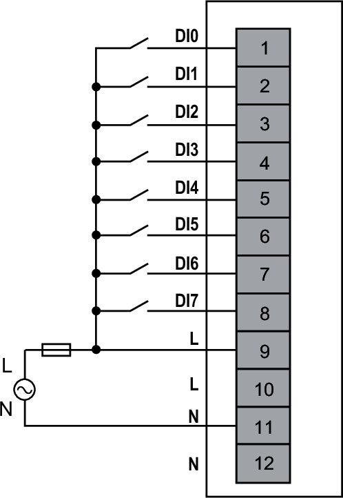

# Wiring Diagram

The input channels of the NTSDAI0804 module require one shared external 120 Vac power supply connected to the terminal block.

| WARNING | |
| --- | --- |
|  | UNINTENDED EQUIPMENT OPERATION  Use the sensor and actuator power supply only for supplying power to sensors or actuators connected to the module.  Failure to follow these instructions can result in death, serious injury, or equipment damage. |

The following figure illustrates an example of 1-wire connection inputs with a shared external power supply:

**External Fuse**: Type F, 1 A, 120 Vac is mandatory and must be chosen in compliance with IEC60269 standard.

EIO0000005238.02