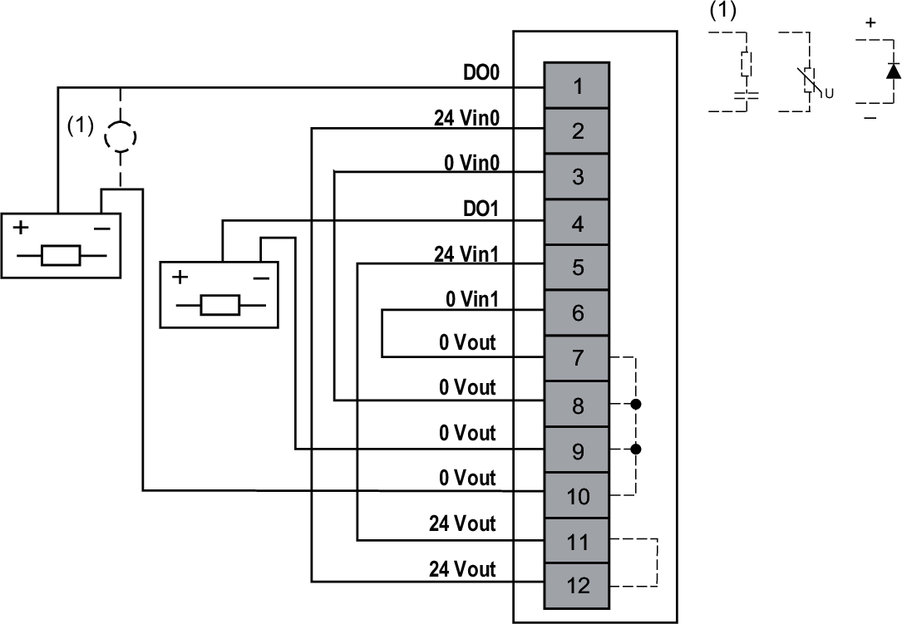
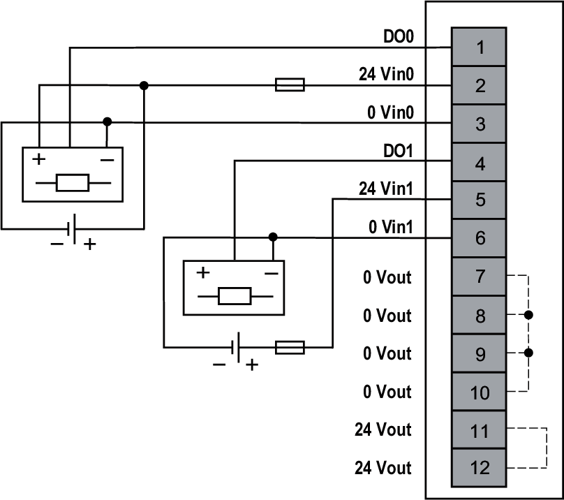

# Wiring Diagrams

This module allows the use of an external power supply to energize the actuators.

To maintain the isolation between channels, use two independent power supplies.

| WARNING | |
| --- | --- |
|  | UNINTENDED EQUIPMENT OPERATION  Use the sensor and actuator power supply only for supplying power to sensors or actuators connected to the module.  Failure to follow these instructions can result in death, serious injury, or equipment damage. |

The following figure illustrates an example of 2-wire connection outputs with the internal power supply without isolation between channels:

The following figure illustrates an example of 2-/3-wire connection outputs with an external power supply and isolation between channels:

**External Fuse**: Type F, 5 A, 24 Vdc is mandatory and must be chosen in compliance with IEC60269 standard.

EIO0000005238.02