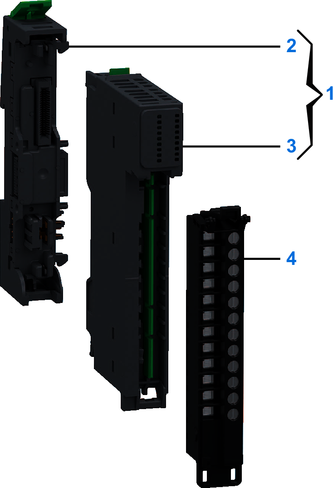

# Purchasing Information

The following figure shows the elements of the Modicon Edge I/O NTS NTSDDO0802 output module:

| Number | Reference | Description |
| --- | --- | --- |
| 1 | NTSDDO0802K | Base + Module (kit) NOTE: The module and its corresponding base can be purchased as a kit. |
| 2 | NTSXBA0100H | Spare Base, 1 Slot, for Input/Output Common or Expert Module, Hardened |
| 3 | NTSDDO0802 | Discrete Output Module, 8 Outputs, 24 Vdc, 2 A, Source, Protected, External Supply, 1-wire |
| 4 | NTSXTB12200H | Spring Terminal Block, 12 Points, 5 mm Pitch, Without Cover, use on Low Height Module, Hardened |
| NTSXTB12201H | Spring Terminal Block, 12 Points, 5 mm Pitch, With Cover, use on Low Height Module, Hardened |
| NTSXTB12000H | Screw Terminal Block, 12 Points, 5 mm Pitch, Without Cover, use on Low Height Module, Hardened |
| NTSXTB12001H | Screw Terminal Block, 12 Points, 5 mm Pitch, With cover, use on Low Height Module, Hardened  **NOTE:** The terminal blocks are purchased separately. |

NOTE: For more information on accessories and spare parts, refer to [Modicon Edge I/O - System Planning and Installation Guide](../../../../../api/crossBook?lang=en-US&virtualBookName=EdgeIO_Spig&topicID=Overview_13555215).

EIO0000005238.02