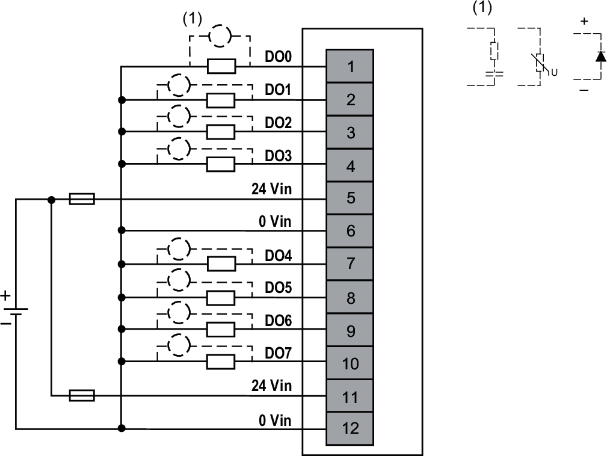

# Wiring Diagram

Each group of inputs requires an external 24 Vdc power supply with a 4 A fuse.

| WARNING | |
| --- | --- |
|  | UNINTENDED EQUIPMENT OPERATION  Use the sensor and actuator power supply only for supplying power to sensors or actuators connected to the module.  Failure to follow these instructions can result in death, serious injury, or equipment damage. |

The following figure illustrates an example of 2-/3-wire connection outputs with and external power supply:

**External Fuse**: Type F, 4 A, 24 Vdc is mandatory and must be chosen in compliance with IEC60269 standard.

EIO0000005238.02