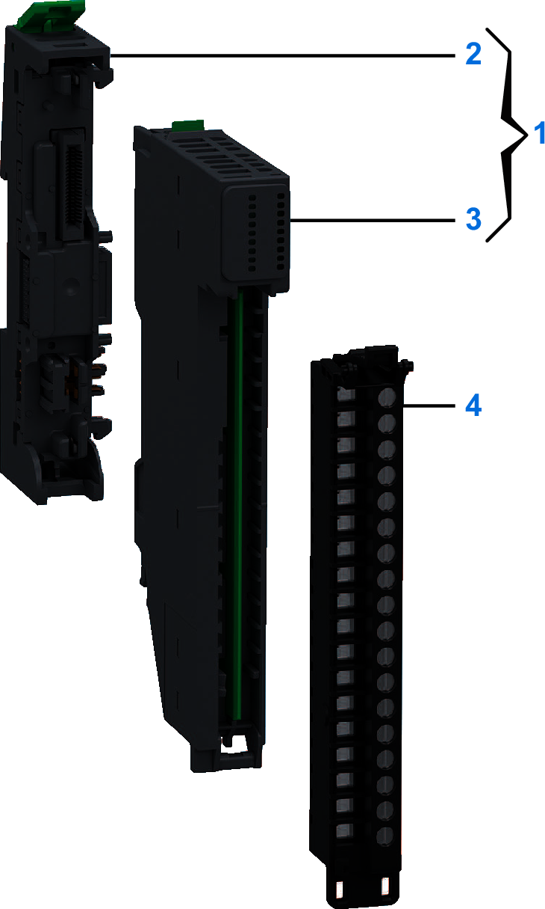

# Purchasing Information

The following figure shows the elements of the Modicon Edge I/O NTS NTSDDO0802X output modules:

| Number | Reference | Description |
| --- | --- | --- |
| 1 | NTSDDO0802XK | Base + Module (kit) NOTE: The module and its corresponding base can be purchased as a kit. |
| 2 | NTSXBA0100H | Spare Base, 1 Slot, for Input/Output Common or Expert Module, Hardened |
| 3 | NTSDDO0802X | Discrete Output Module, 8 Outputs, 24 Vdc, 500 mA, Source, Protected, 1-/2-wire |
| 4 | NTSXTB18200XH | Spring Terminal Block, 18 Points, 5 mm Pitch, Without Cover, use on High Height Module (X), Hardened |
| NTSXTB18201XH | Spring Terminal Block, 18 Points, 5 mm Pitch, With Cover, use on High Height Module (X), Hardened |
| NTSXTB18000XH | Screw Terminal Block, 18 Points, 5 mm Pitch, Without Cover, use on High Height Module (X), Hardened |
| NTSXTB18001XH | Screw Terminal Block, 18 Points, 5 mm Pitch, With Cover, use on High Height Module (X), Hardened  **NOTE:** The terminal blocks are purchased separately. |

NOTE: For more information on accessories and spare parts, refer to [Modicon Edge I/O - System Planning and Installation Guide](../../../../../api/crossBook?lang=en-US&virtualBookName=EdgeIO_Spig&topicID=Overview_13555215).

EIO0000005238.02