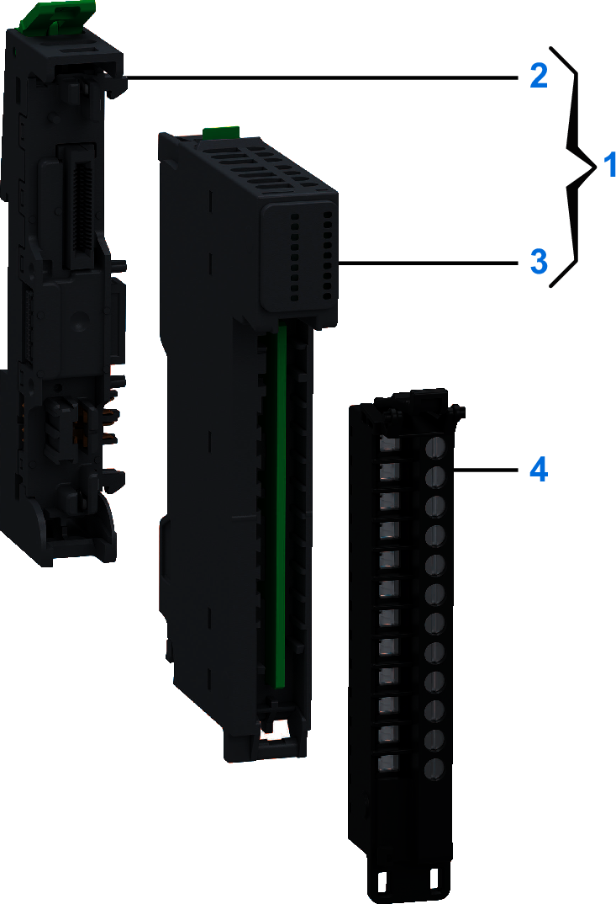

# Purchasing Information

The following figure shows the elements of the Modicon Edge I/O NTS NTSDAO0205 output module:

| Number | Reference | Description |
| --- | --- | --- |
| 1 | NTSDAO0205K | Base + Module (kit) NOTE: The module and its corresponding base can be purchased as a kit. |
| 2 | NTSXBA0100H | Spare Base, 1 Slot, for Input/Output Common or Expert Module, Hardened |
| 3 | NTSDAO0205 | Discrete Output Module, 2 Outputs, 1 A, 100...240 Vac, 1-/2-/3-wire |
| 4 | NTSXTB12211H | Spring Terminal Block, 12 Points, 5 mm Pitch, With Cover, AC, use on Low Height Module, Hardened |
| NTSXTB12011H | Screw Terminal Block, 12 Points, 5 mm Pitch, With Cover, AC, use on Low Height Module, Hardened |
| NTSXTB12210H | Spring Terminal Block, 12 Points, 5 mm Pitch, Without Cover, AC, use on Low Height Module, Hardened |
| NTSXTB12010H | Screw Terminal Block, 12 Points, 5 mm Pitch, Without Cover, AC, use on Low Height Module, Hardened  **NOTE:** The terminal blocks are purchased separately. |

NOTE: For more information on accessories and spare parts, refer to [Modicon Edge I/O - System Planning and Installation Guide](../../../../../api/crossBook?lang=en-US&virtualBookName=EdgeIO_Spig&topicID=Overview_13555215).

EIO0000005238.02