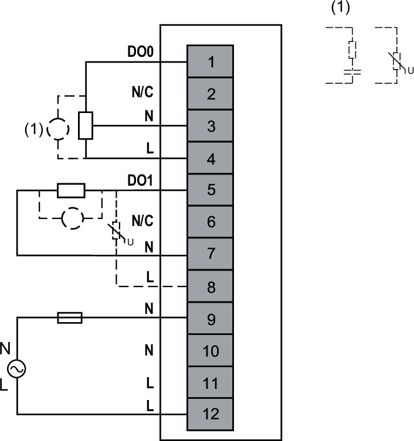

# Wiring Diagram

Each group of inputs requires an external 100...240 Vac power supply with a 5 A / 250 V fuse.

| WARNING | |
| --- | --- |
|  | UNINTENDED EQUIPMENT OPERATION  Use the sensor and actuator power supply only for supplying power to sensors or actuators connected to the module.  Failure to follow these instructions can result in death, serious injury, or equipment damage. |

The following figure illustrates an example of 2-/3-wire connection outputs with an external power supply:

**External Fuse**: Type F, 5 A, 250 Vac is mandatory and must be chosen in compliance with IEC60269 standard.  
**N/C**: No Connection

| WARNING | |
| --- | --- |
|  | UNINTENDED EQUIPMENT OPERATION  Do not connect wires to unused terminals and/or terminals indicated as “No Connection (N/C)”.  Failure to follow these instructions can result in death, serious injury, or equipment damage. |

EIO0000005238.02