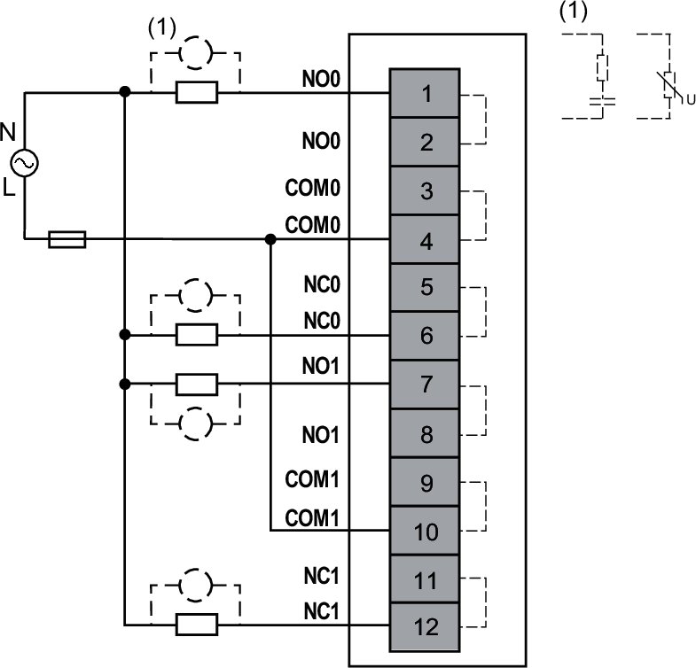
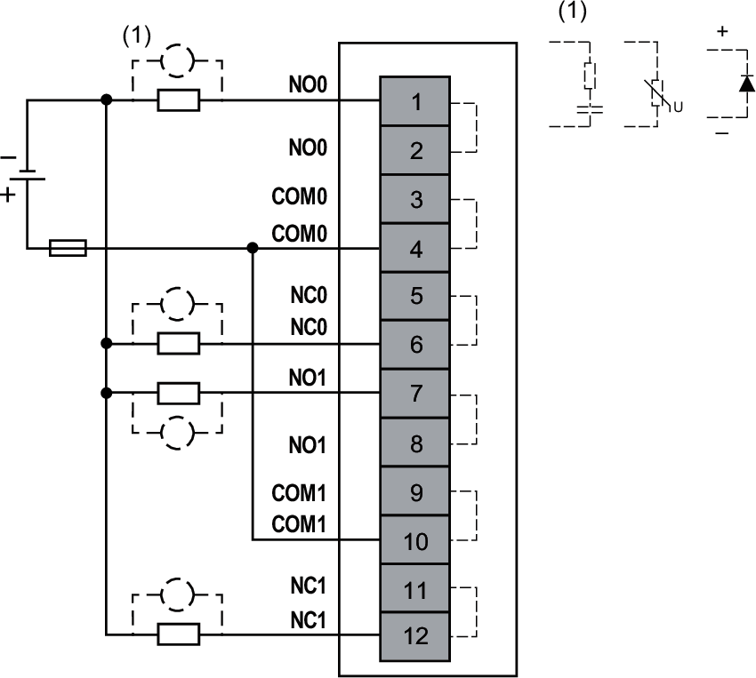
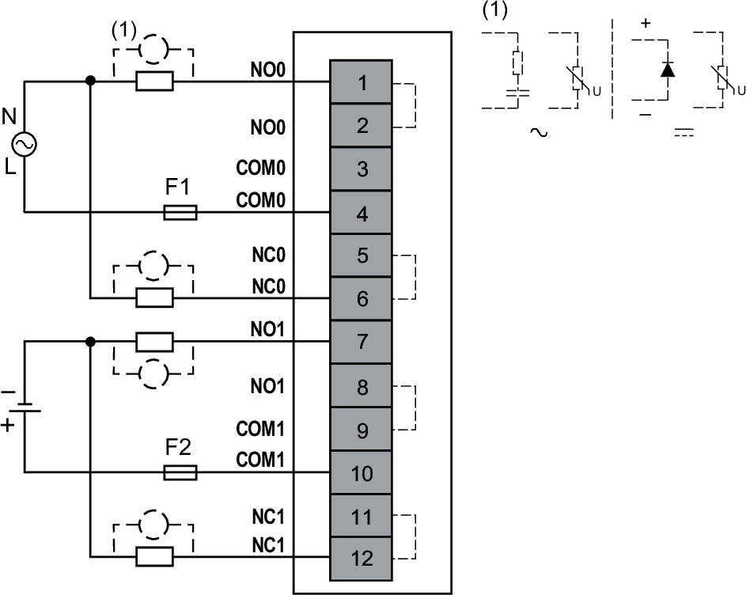

# Wiring Diagrams

Each channel requires an external power supply (AC or DC) with the appropriate output protection.

To maintain the isolation between channels, use independent power supplies.

| WARNING | |
| --- | --- |
|  | UNINTENDED EQUIPMENT OPERATION  Use the sensor and actuator power supply only for supplying power to sensors or actuators connected to the module.  Failure to follow these instructions can result in death, serious injury, or equipment damage. |

The following figure illustrates an example of 2-wire connection outputs with an external AC power supply and without isolation between channels:

**External Fuse**: Type F, 2 A, 250 Vac is mandatory and must be chosen in compliance with IEC60269 standard.

The following figure illustrates an example of 2-wire connection outputs with an external DC power supply and without isolation between channels:

**External Fuse**: Type F, 2 A, 125 Vdc is mandatory and must be chosen in compliance with IEC60269 standard.

The following figure illustrates an example of 2-wire connection outputs with an external AC and DC power supply and isolation between channels:

**F1**: External fuse type F, 2 A, 250 Vac is mandatory and must be chosen in compliance with IEC60269 standard.  
**F2**: External fuse type F, 2 A, 125 Vdc is mandatory and must be chosen in compliance with IEC60269 standard.

| WARNING | |
| --- | --- |
|  | UNINTENDED EQUIPMENT OPERATION  Do not connect SELV power supply and hazardous voltage power supply to adjacent channels.  Failure to follow these instructions can result in death, serious injury, or equipment damage. |

EIO0000005238.02