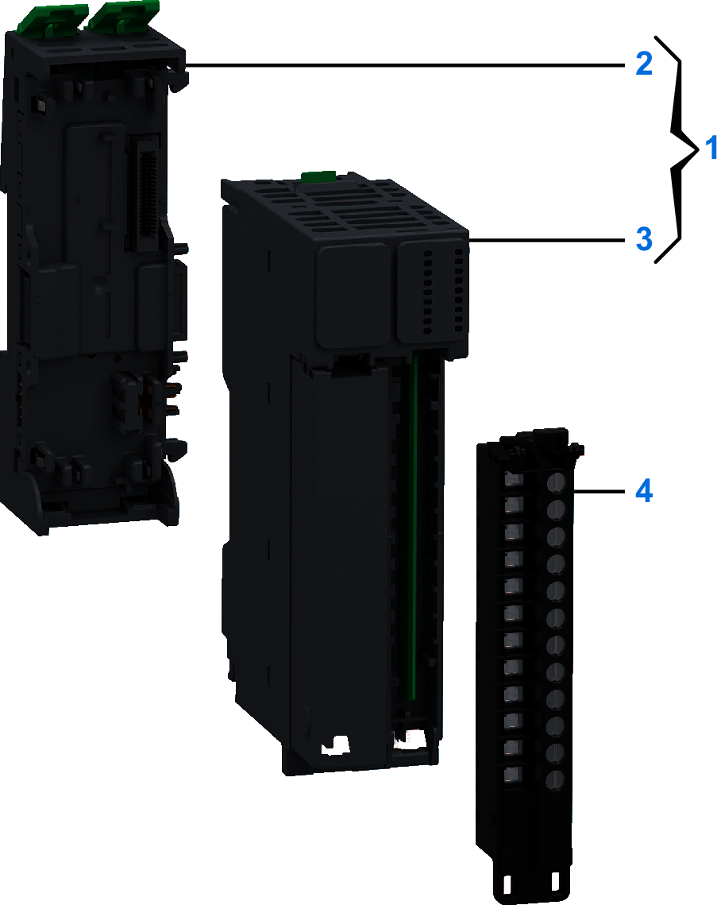

# Purchasing Information

The following figure shows the elements of the Modicon Edge I/O NTS NTSDRA0615 output module:

| Number | Reference | Description |
| --- | --- | --- |
| 1 | NTSDRA0615K | Base + Module (kit) NOTE: The module and its corresponding base can be purchased as a kit. |
| 2 | NTSXBA0200H | Spare Base, 2 Slots, for Input/Output Common/Expert/Safety Module, Hardened |
| 3 | NTSDRA0615 | Relay Output Module, 6 Isolated Outputs, NO, 2 A, 5...125 Vdc, 24...240 Vac |
| 4 | NTSXTB12211H | Spring Terminal Block, 12 Points, 5 mm Pitch, With Cover, AC, use on Low Height Module, Hardened |
| NTSXTB12011H | Screw Terminal Block, 12 Points, 5 mm Pitch, With Cover, AC, use on Low Height Module, Hardened |
| NTSXTB12210H | Spring Terminal Block, 12 Points, 5 mm Pitch, Without Cover, AC, use on Low Height Module, Hardened |
| NTSXTB12010H | Screw Terminal Block, 12 Points, 5 mm Pitch, Without Cover, AC, use on Low Height Module, Hardened  **NOTE:** The terminal blocks are purchased separately. |

NOTE: For more information on accessories and spare parts, refer to [Modicon Edge I/O - System Planning and Installation Guide](../../../../../api/crossBook?lang=en-US&virtualBookName=EdgeIO_Spig&topicID=Overview_13555215).

EIO0000005238.02