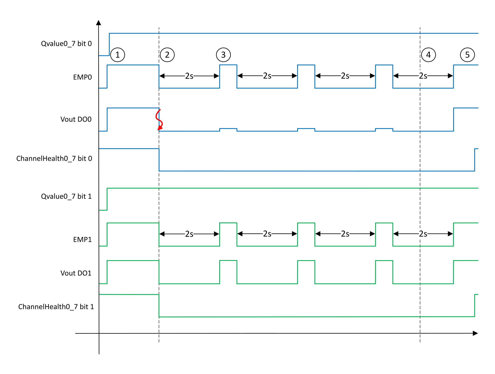
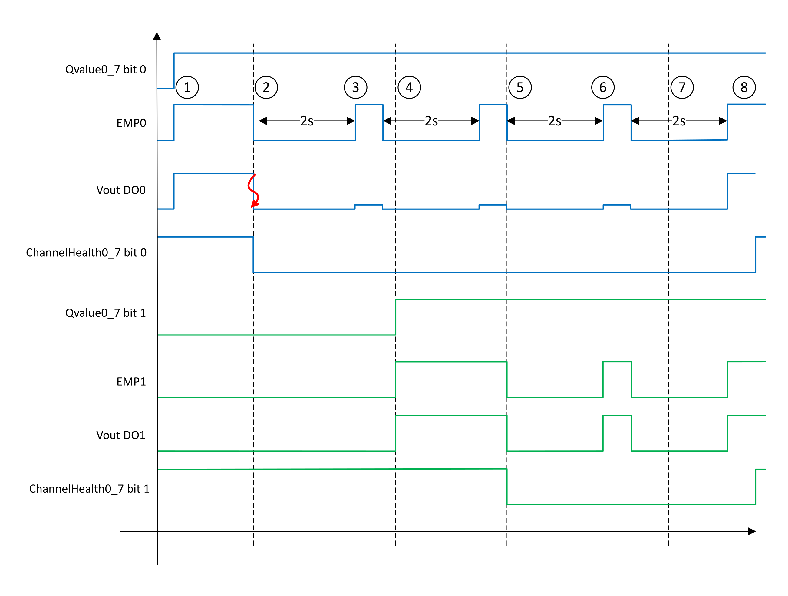

# Auto Recovery Mode

Depending on the use case, the Auto Recovery mode attempts to re-arm the output or outputs every two seconds by energizing the output or outputs for a duration of 10 ms + 2 x IO Bus Cycle Time in an infinite cycle. At any point when a short circuit is no longer detected on either of the outputs, the Auto Recovery terminates and the outputs in the pair take on their proper state as determined by the logical value of the outputs (as defined in the bytes Qvalue0\_7 or Qvalue8\_15, depending on the pair).

## Both Outputs Energized

If both outputs in the pair were energized prior to short circuit detection, and whether there was a short circuit on one or the other output of the pair, or both outputs of the pair, both outputs are treated with the Auto Recovery algorithm.

If only one of the two outputs had, in reality, a short circuit while the other output in the pair did not exhibit a short circuit, both outputs will be subjected to the Auto Recovery algorithm regardless, as depicted in the following diagram with the output pair DO0 and DO1 as examples:

|  |  |
| --- | --- |
| Stage | Description |
| 1 | When Qvalue0\_7 bit 0 and bit 1 are TRUE, the DO0 and DO1 outputs are energized (EMP0 and EMP1 are set to TRUE). |
| 2 | When a short circuit is detected on output DO0:   * ChannelHealth0\_7 bit 0 and bit 1 are set to FALSE. * The DO0 and DO1 outputs are de-energized (EMP0 and EMP1 are set to FALSE). * Auto recovery algorithm starts for the DO0 and DO1 outputs. |
| 3 | Every two seconds, the auto-recovery algorithm energizes the outputs DO0 and DO1 (Vout > 0) for a duration of 10 ms + 2 x IO Bus Cycle Time.  At the end of the cycle, the short circuit is still detected, DO0 and DO1 output are de-energized. |
| 4 | The cause of the short circuit is cleared. |
| 5 | The auto recovery algorithm energizes the outputs DO0 and DO1 and no short circuit is detected.  At the end of the cycle, ChannelHeatlh0\_7 bit 0 and bit 1 are set to TRUE. At this point, normal operation resumes. |

| WARNING | |
| --- | --- |
|  | UNINTENDED EQUIPMENT OPERATION  Inhibit the automatic rearming of outputs if this feature presents undesirable operation of your machine or process.  Failure to follow these instructions can result in death, serious injury, or equipment damage. |

## One Output Energized

If only one of the outputs in the pair is energized at short circuit detection, then evidently the output that is energized caused the diagnostic detection and is subject to the Auto Recovery algorithm.

The other output in the pair that was de-energized at the short circuit detection is considered healthy and is not subject to the Auto Recovery algorithm.

Assuming that DO0 has the short circuit for example, ChannelHealth0\_7 bit 0 would be FALSE and ChannelHealth0\_7 bit 1 would be TRUE as long as the unaffected output remained de-energized for the duration of the Auto Recovery algorithm.

If, however, the unaffected output of the pair is energized and remains energized during one of the retries, the unaffected output joins the short circuited output in the Auto Recovery algorithm, as depicted in the following diagram:

|  |  |
| --- | --- |
| Stage | Description |
| 1 | When Qvalue0\_7 bit 0 is TRUE, the DO0 outputs is energized (EMP0 is set to TRUE). |
| 2 | When a short circuit is detected on output DO0:   * ChannelHealth0\_7 bit 0 is set to FALSE. * The DO0 output is de-energized (EMP0 is set to FALSE). * Auto recovery algorithm starts for the DO0 output.   NOTE: Since Qvalue0\_7 bit 1 is FALSE, DO1 is de-energized and ChannelHealth0\_7 bit 1 keeps its present state. |
| 3 | Every two seconds, the auto-recovery algorithm energizes the outputs DO0 (Vout > 0) for a duration of 10 ms + 2 x IO Bus Cycle Time.  The short circuit is still detected on DO0 and is de-energized at the end of the cycle. |
| 4 | In this example, Qvalue0\_7 bit 1 becomes TRUE, the DO1 output is energized (EMP1 is set to TRUE). |
| 5 | When the auto recovery algorithm energizes the output DO0 (Vout > 0) and the short circuit is still detected on output DO0, at the end of the cycle and because DO1 is energized while a retry is attempted:   * ChannelHealth0\_7 bit 1 is set to FALSE. * The DO0 and DO1 output are de-energized (EMP0 and EMP1 is set to FALSE). * Auto recovery algorithm starts for DO0 and DO1 outputs. |
| 6 | Every two seconds, the auto-recovery algorithm energizes the outputs DO0 and DO1 (Vout > 0) for a duration of 10 ms + 2 x IO Bus Cycle Time.  At the end of the cycle, the short circuit is still detected, DO0 and DO1 output are de-energized. |
| 7 | The cause of the short circuit is cleared. |
| 8 | The auto recovery algorithm energizes the outputs DO0 and DO1 and no short circuit is detected.  At the end of the cycle, ChannelHeatlh0\_7 bit 0 and bit 1 are set to TRUE. At this point, normal operation resumes. |

| WARNING | |
| --- | --- |
|  | UNINTENDED EQUIPMENT OPERATION  Inhibit the automatic rearming of outputs if this feature presents undesirable operation of your machine or process.  Failure to follow these instructions can result in death, serious injury, or equipment damage. |

EIO0000005238.02