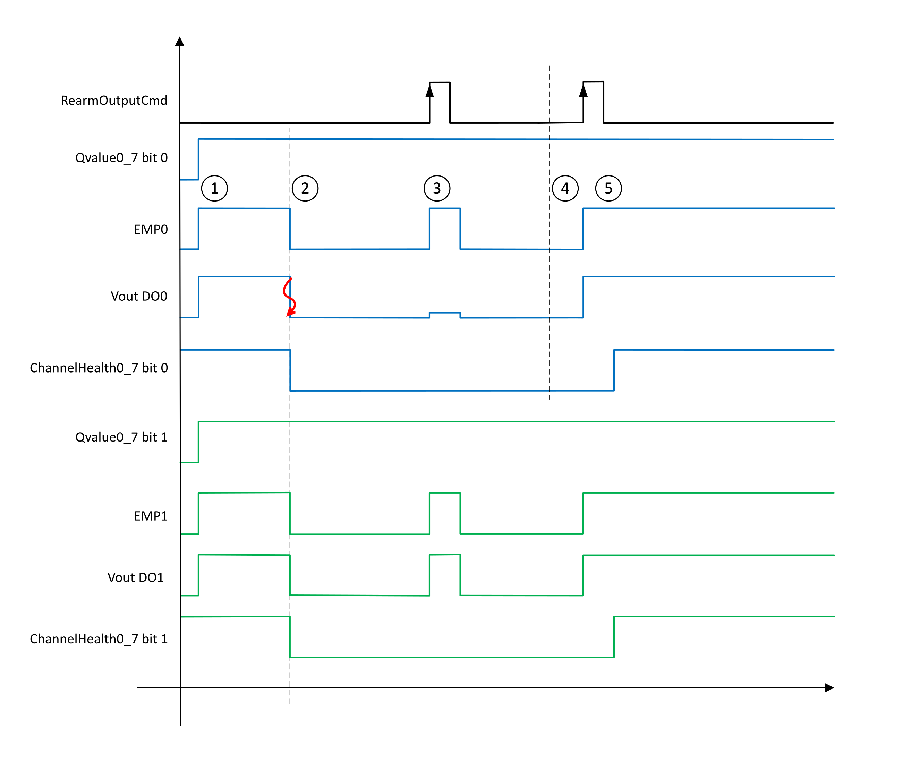
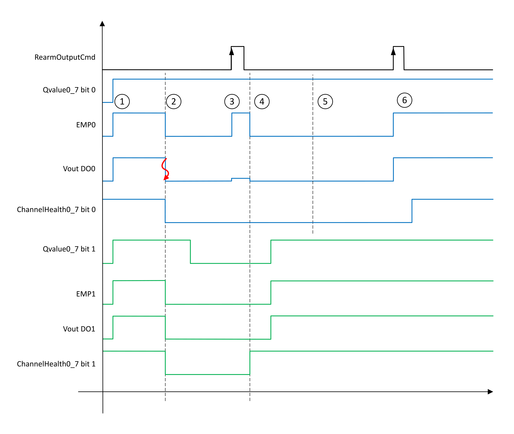
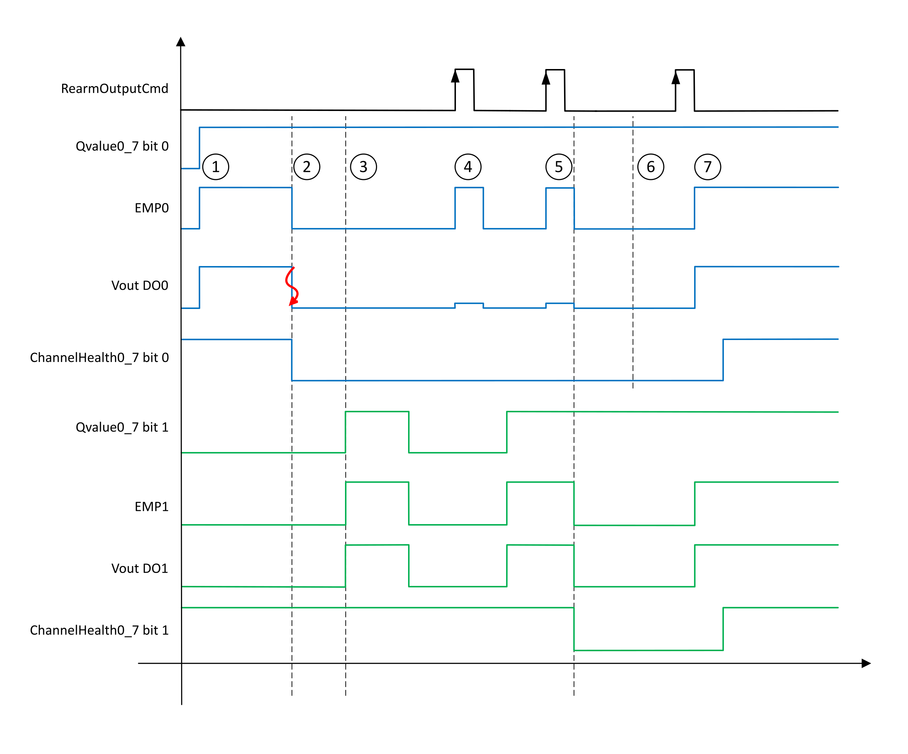

# Latched Off Mode

In Latched Off Mode, the attempt to re-arm the output or outputs by energizing the output or outputs for 10 ms + 2 x IO Bus Cycle Time is on command. The reaction to the command to re-arm depends on the use case. When the short circuit is cleared, and you command the retry, the output or outputs in the pair take on the proper state as determined by the logical value of the outputs (as defined in the bytes Qvalue0\_7 or Qvalue8\_15, depending on the pair).

## Both Outputs Energized

If both outputs in the pair are energized at the time of the detection of a short circuit, and whether there is a short circuit on one or the other outputs of the pair, or both outputs in the pair, both outputs are de-energized and both health bits of the pair are set to FALSE.

Upon a commanded retry, if one or the other, or both, outputs continue to present a short circuit, the outputs of the pair resume their de-energized state as well as the pair of health bits retain their FALSE state.

If instead the short circuit is cleared, and therefore the short circuit error is no longer detected, the outputs of the pair take on the proper state as defined in the bytes Qvalue0\_7 or Qvalue8\_15, depending on the pair.

This behavior is depicted in the following diagram:

|  |  |
| --- | --- |
| Stage | Description |
| 1 | When Qvalue0\_7 bit 0 and bit 1 are TRUE, the DO0 and DO1 outputs are energized (EMP0 and EMP1 are set to TRUE). |
| 2 | When a short circuit is detected on output DO0:   * ChannelHealth0\_7 bit 0 and bit 1 are set to FALSE. * The DO0 and DO1 outputs are de-energized (EMP0 and EMP1 are set to FALSE). |
| 3 | A rising edge on RearmOutputCmd starts the retry attempt. The DO0 and DO1 outputs are energized (Vout > 0) for a duration of 10 ms + 2 x IO Bus Cycle Time.  At the end of the retry attempt duration, the short circuit is still detected, DO0 and DO1 output are de-energized. |
| 4 | The cause of the short circuit is cleared. |
| 5 | A rising edge on RearmOutputCmd starts the retry attempt. No short circuit is detected, ChannelHeatlh0\_7 bit 0 and bit 1 are set to TRUE at the end of the retry attempt. At this point, normal operation resumes. |

However, if in the interim between when a short circuit is detected and the command to retry, you set by whatever logical means the Qvalue0\_7 bit of the unaffected output of the pair to FALSE, upon the command to retry, the de-energized output has its health bit set to TRUE, and thereafter assume the proper state as defined in the bytes Qvalue0\_7 or Qvalue8\_15, depending on the pair (assuming that the short circuit was not detected on the de-energized output).

This behavior is depicted in the following diagram:

|  |  |
| --- | --- |
| Stage | Description |
| 1 | When Qvalue0\_7 bit 0 and bit 1 are TRUE, the DO0 and DO1 outputs are energized (EMP0 and EMP1 are set to TRUE). |
| 2 | When a short circuit is detected on output DO0:   * ChannelHealth0\_7 bit 0 and bit 1 are set to FALSE. * The DO0 and DO1 outputs are de-energized (EMP0 and EMP1 are set to FALSE). |
| 3 | A rising edge on RearmOutputCmd starts the retry attempt. Qvalue0\_7 bit 1 is FALSE, only DO0 outputs is energized ((Vout > 0) for a duration of 10 ms + 2 x IO Bus Cycle Time, at the end of the retry attempt duration:   * The short circuit is still detected, DO0 output is de-energized. * ChannelHealth0\_7 bit 1 is set to TRUE. |
| 4 | In this example, Qvalue0\_7 bit 1 becomes TRUE, the DO1 output is energized (EMP1 is et to TRUE). |
| 5 | The cause of the short circuit is cleared. |
| 6 | A rising edge on RearmOutputCmd starts the retry attempt. No short circuit is detected, ChannelHeatlh0\_7 bit 0 and bit 1 are set to TRUE at the end of the retry attempt. At this point, normal operation resumes. |

## One Output Energized

If only one of the outputs in the pair is energized at the detection of the short circuit, then evidently the output that is energized caused the diagnostic detection. The output is de-energized and has its health bit set to FALSE, while the other output of the pair that was de-energized at the detection of the short circuit is considered healthy.

This remains the case as long as the output that was de-energized at the time of detection remains de-energized, however:

* If the unaffected output is energized and a short circuit is still detected while a command to retry is attempted, then both outputs are de-energized and their health bits set to FALSE.
* If instead, the output is returned to a de-energized state prior to a command to retry while the short circuit remains active, the output continues to present a healthy status. It is only if the output is energized and an unsuccessful retry is attempted that the error state is applied to both outputs in the pair.

This behavior is depicted in the following diagram:

|  |  |
| --- | --- |
| Stage | Description |
| 1 | When Qvalue0\_7 bit 0 is TRUE, the DO0 output is energized (EMP0 is set to TRUE). |
| 2 | When a short circuit is detected on output DO0:   * ChannelHealth0\_7 bit 0 is set to FALSE. * The DO0 output is de-energized (EMP0 is set to FALSE).   NOTE: Since Qvalue0\_7 bit 1 is FALSE, D01 is de-energized and ChannelHealth0\_7 bit 1 keep its present state. |
| 3 | In this example, Qvalue0\_7 bit 1 becomes TRUE, the DO1 output is energized (EMP1 is set to TRUE). |
| 4 | A rising edge on RearmOutputCmd starts the retry attempt. The DO0 output is energized (Vout > 0) for a duration of 10 ms + 2 x IO Bus Cycle Time. At the end of the retry attempt duration, the short circuit is still detected, DO0 outputs is de-energized.  Qvalue0\_7 bit 1 is FALSE, DO1 is de-energized during the retry attempt, therefor ChannelHealth0\_7 bit 1 keeps its present state |
| 5 | A rising edge on RearmOutputCmd starts the retry attempt. The DO0 output is energized (Vout > 0) for a duration of 10 ms + 2 x IO Bus Cycle Time. In this case DO1 is energized during an unsuccessful retry attempt, and at the end of the retry attempt duration:   * ChannelHealth0\_7 bit 1 is set to FALSE. * The DO0 and DO1 outputs are de-energized (EMP1 is set to FALSE). |
| 6 | The cause of the short circuit is cleared. |
| 7 | A rising edge on RearmOutputCmd starts the retry attempt. No short circuit is detected, ChannelHeatlh0\_7 bit 0 and bit 1 are set to TRUE at the end of the retry attempt. At this point, normal operation resumes. |

EIO0000005238.02