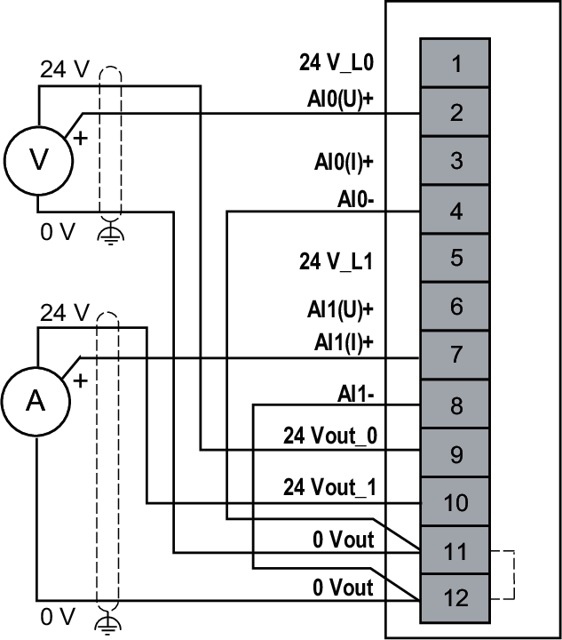
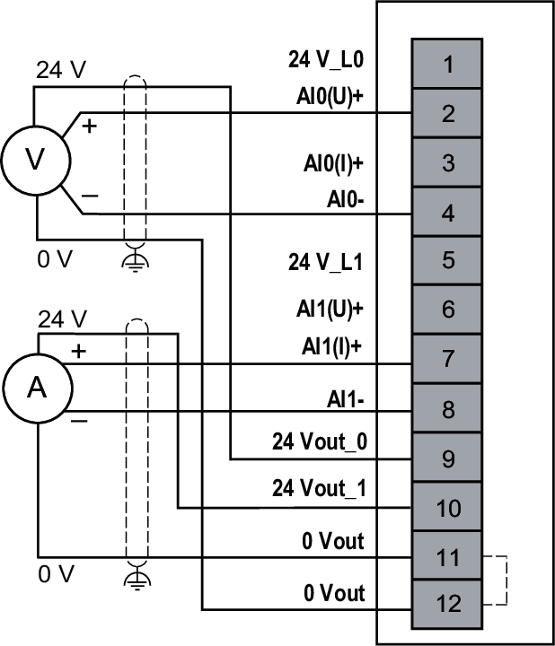

# Wiring Diagrams

Loop power supply is used with 2-wire 4...20 mA current sensor and provides a maximum current of 25 mA.

Sensor power supply is used with 3-wire or 4-wire current or voltage sensor, and provides a maximum current of 100 mA per channel.

The 3-wire sensor or 4-wire sensor may be malfunctioning due to the loop power limited load capacity of 25 mA per channel, whereas the sensor may require more than 25 mA.

The isolation between the analog module section and the field sensor power is not effective if a 3-wire sensor or a 4-wire sensor with a non-isolated output is used.

The isolation between channels is not effective if two 3-wire or 4-wire sensors with non-isolated outputs share the same power supply (either 24 Vdc from the analog module or an external power supply connected).

Further, as the sensor power could be misused as loop power, the input value may be abnormal due to a broken current loop. Additionally, the isolation between channels is not effective if the same miswiring is applied to the two channels.

| NOTICE | |
| --- | --- |
|  | INOPERABLE EQUIPMENT  Do not connect the 24 Vdc output sensor power supply with the 24 Vdc loop power supply of the module.  Failure to follow these instructions can result in equipment damage. |

You may choose to use an external power supply to provide sensor power or loop power in case a larger current is required for the sensor.

## Current and Voltage Measurement 2-Wire Diagram

The following figures illustrate the connection between the inputs and the sensors:

|  |  |
| --- | --- |
|  |  |
| **24 V\_L•**: Loop power **24 Vout\_•**: Sensor power **A**: Current **(U)**: Voltage **(I)**: Current | **24 V\_L•**: Loop power **24 Vout\_•**: Sensor power **V**: Voltage **(U)**: Voltage **(I)**: Current |

## Current and Voltage Measurement 3-Wire Diagram

The following figure illustrates the connection between the inputs and the sensors:

**24 V\_L•**: Loop power  
**24 Vout\_•**: Sensor power  
**V**: Voltage  
**A**: Current  
**(U)**: Voltage  
**(I)**: Current  

NOTE: For 3-wire sensors, connect externally **AI-** to **0 Vout**.

## Current and Voltage Measurement 4-Wire Diagram

The following figure illustrates the connection between the inputs and the sensors:

**24 V\_L•**: Loop power  
**24 Vout\_•**: Sensor power  
**V**: Voltage  
**A**: Current  
**(U)**: Voltage  
**(I)**: Current

EIO0000005246.02