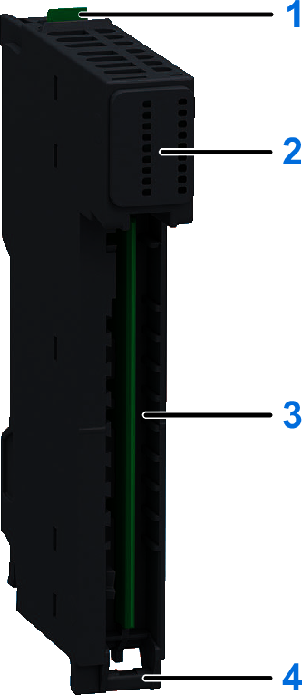

# Physical Description

The following figure presents the elements of the module:

**1**: Release button for disengaging the module from the base  
**2**: Status LEDs  
**3**: Slot for the terminal block  
**4**: Hinge for the terminal block installation

EIO0000005246.02