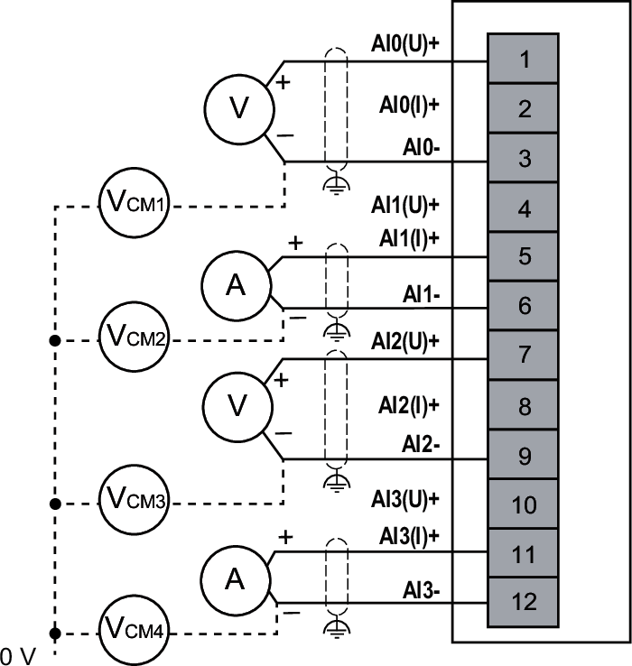

# Wiring Diagram

The following figure illustrates the connection between the inputs and the sensors:

**(U)**: Voltage  
**(I)**: Current  

NOTE: VCM is the common mode voltage relative to 24 Vdc Field power, with maximum allowable common mode voltage between channels of +/- 12 Vdc.

EIO0000005246.02