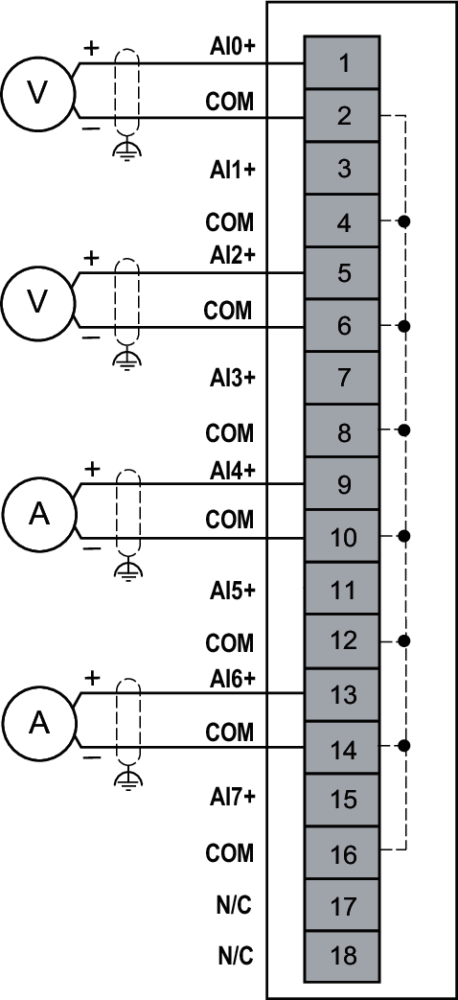

# Wiring Diagram

The following figure illustrates the connection between the inputs and the sensors:

**N/C**: Not Connected

| WARNING | |
| --- | --- |
|  | UNINTENDED EQUIPMENT OPERATION  Do not connect wires to unused terminals and/or terminals indicated as “No Connection (N/C)”.  Failure to follow these instructions can result in death, serious injury, or equipment damage. |

EIO0000005246.02