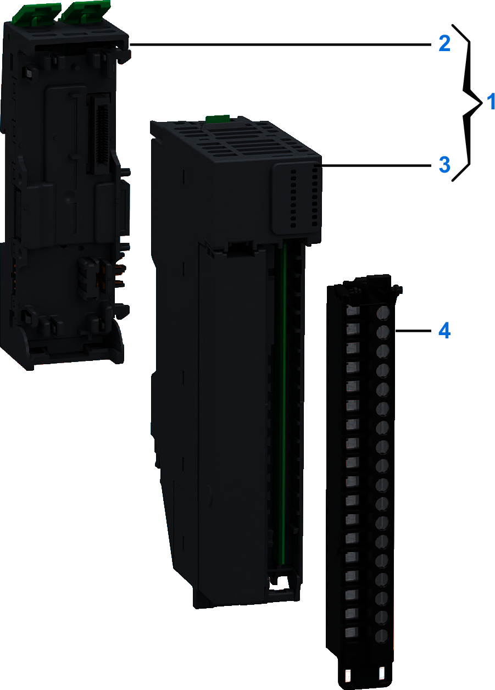

# Purchasing Information

The following figure shows the elements of the Modicon Edge I/O NTS NTSACI0802X/NTSACI0802XH input modules:

| Number | Reference | Description |
| --- | --- | --- |
| 1 | NTSACI0802XK | Base + Module (kit) NOTE: The module and its corresponding base can be purchased as a kit. |
| NTSACI0802XHK |
| 2 | NTSXBA0200H | Spare Base, 2 Slots, for Input/Output Common/Expert/Safety Module, Hardened |
| 3 | NTSACI0802X | Analog Input Module, 8 Inputs, Current, 1-/2-wire, Loop Power |
| NTSACI0802XH | Analog Input Module, 8 Inputs, Current, 1-/2-wire, Loop Power, Hardened |
| 4 | NTSXTB18200XH | Spring Terminal Block, 18 Points, 5 mm Pitch, Without Cover, use on High Height Module (X), Hardened |
| NTSXTB18201XH | Spring Terminal Block, 18 Points, 5 mm Pitch, With Cover, use on High Height Module (X), Hardened |
| NTSXTB18000XH | Screw Terminal Block, 18 Points, 5 mm Pitch, Without Cover, use on High Height Module (X), Hardened |
| NTSXTB18001XH | Screw Terminal Block, 18 Points, 5 mm Pitch, With Cover, use on High Height Module (X), Hardened  **NOTE:** The terminal blocks are purchased separately. |

NOTE: For more information on accessories and spare parts, refer to [Modicon Edge I/O - System Planning and Installation Guide](../../../../../api/crossBook?lang=en-US&virtualBookName=EdgeIO_Spig&topicID=Overview_13555215).

EIO0000005246.02