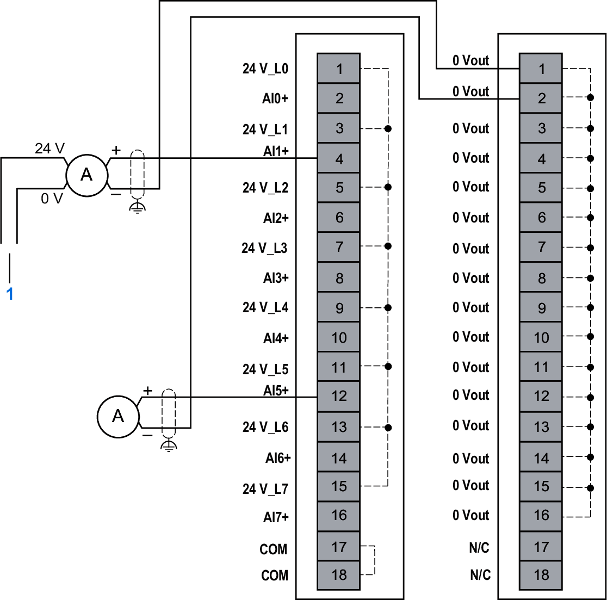
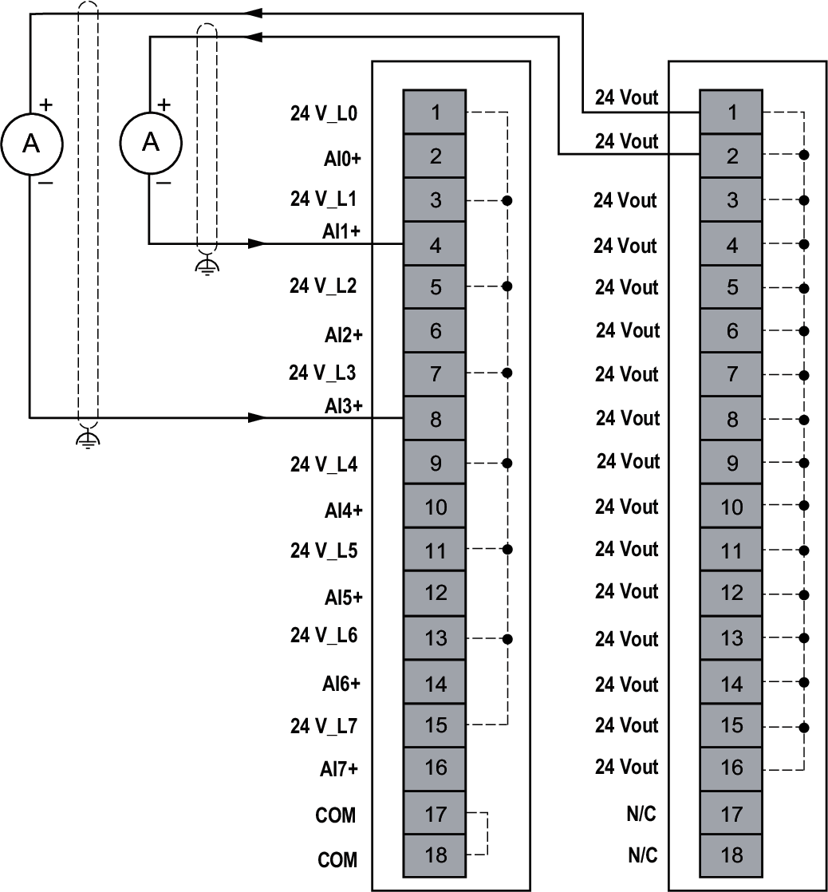

# Wiring Diagrams

Loop power supply is used with 2-wire 4...20 mA current sensor and provides a maximum current of 25 mA.

You may choose to use an external power supply to provide loop power.

## Current Measurement 1-Wire Diagram

The following figure illustrates the 1-wire connection with 0 V on Common module (NTSPCM0016H) between the inputs and the sensors:

**1**: External supply  
**24 V\_L•**: Loop power  
**0 Vout**: Common module output  
**A**: Current  
**N/C**: Not Connected

| WARNING | |
| --- | --- |
|  | UNINTENDED EQUIPMENT OPERATION  Do not connect wires to unused terminals and/or terminals indicated as “No Connection (N/C)”.  Failure to follow these instructions can result in death, serious injury, or equipment damage. |

The following figure illustrates the 1-wire connection with 24 V on Common module (NTSPCM1600H) between the inputs and the sensors:

**24 V\_L•**: Loop power  
**24 Vout**: Common module output  
**A**: Current  
**N/C**: Not Connected

| WARNING | |
| --- | --- |
|  | UNINTENDED EQUIPMENT OPERATION  Do not connect wires to unused terminals and/or terminals indicated as “No Connection (N/C)”.  Failure to follow these instructions can result in death, serious injury, or equipment damage. |

## Current Measurement 2-Wire Diagram

The following figure illustrates the connection between the inputs and the sensors using two common modules (NTSPCM1600H and NTSPCM0016H):

|  |  |  |
| --- | --- | --- |
|  | | |
|  | **24 V\_L•**: Loop power **24 Vout**: Common module output **0 Vout**: Common module output **A**: Current **N/C**: Not Connected |  |

| WARNING | |
| --- | --- |
|  | UNINTENDED EQUIPMENT OPERATION  Do not connect wires to unused terminals and/or terminals indicated as “No Connection (N/C)”.  Failure to follow these instructions can result in death, serious injury, or equipment damage. |

EIO0000005246.02