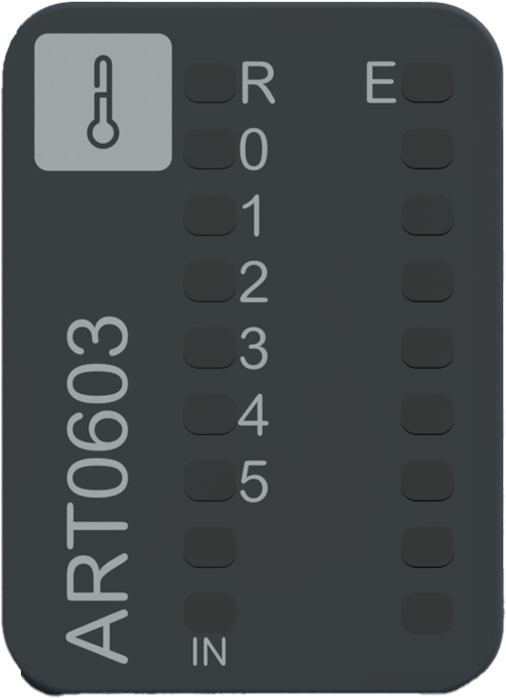

# Status LEDs

The following figure presents the NTSART0603 status LEDs:

The following table describes the status of LEDs:

| R (Green) | E (Red) | Channel  (Green) | Description |
| --- | --- | --- | --- |
| **Initialization and non-operational states** | | | |
| OFF | OFF | OFF | Indicates that the module is not energized. |
| OFF | Fast Flash | - | Indicates that the module has detected a system error. |
| Regular Flash | OFF | - | Indicates that the firmware is being updated. |
| Regular Flash | ON | - | Indicates that a module mismatch is detected. |
| Single Flash | OFF | - | Indicates that the module is energized and not configured. |
| **Operational state** | | | |
| ON | OFF | - | Indicates that the module is energized, configured and operational. |
| ON | - | ON | Indicates that the channel is activated. |
| ON | - | OFF | Indicates that the channel is deactivated. |
| ON | Single Flash | - | Indicates an advisory detection. |
| ON | Single Flash | Single Flash | Indicates:  * Lower tolerance advisory detection. * Upper tolerance advisory detection. |
| ON | Regular Flash | OFF | Indicates that an error is detected in the 24 Vdc field power. |
| ON | Regular Flash | Regular Flash | Indicates:  * Broken wire detection. * Overflow/underflow error detection. |
| ON | Regular Flash | OFF | Indicates an internal error detection. |

The following graphic shows the system status of LEDs during module operation:

EIO0000005246.02