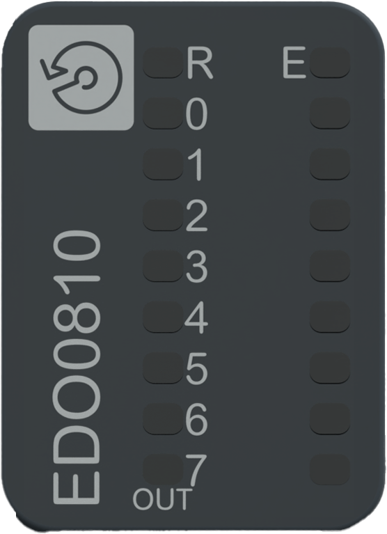

# Status LEDs

The following figure presents the NTSEDO0810 status LEDs:

The following table describes the status of LEDs:

| **R**  (Green) | **E**  (Red) | **OUT0...7**  (Green) | Description |
| --- | --- | --- | --- |
| **Initialization and non-operational states** | | | |
| OFF | OFF | - | Indicates that the module is not energized. |
| OFF | ON | - | Indicates that an internal error is detected. |
| OFF | Regular Flash | - | Indicates that a system error is detected. |
| Single Flash | OFF | - | Indicates that the module is not configured. |
| Regular Flash | OFF | - | Indicates that the firmware is being updated. |
| Regular Flash | ON | - | Indicates that a module mismatch is detected. |
| **Operational state** | | | |
| ON | OFF | - | Indicates that the module is powered, configured and operational. |
| Fast flash | OFF | - | Indicates that the module is running a valid application that is stopped. |
| ON | OFF | ON | Indicates that the corresponding output channel is activated. |
| ON | OFF | OFF | Indicates that the corresponding output channel is deactivated. |
| ON | Single Flash | - | Indicates one of the following:  * The module is restarting. * An advisory is detected. |
| ON | Regular Flash | - | Indicates one of the following:  * An error is detected at the channel level. * The module is in fallback state. |
| ON | ON | - | Indicates that an error is detected at the module level. |
| ON | Regular Flash | OFF | Indicates that an error is detected in the 24 Vdc field power. |
| ON | Regular Flash | Regular Flash | Indicates that a short circuit is detected on the output. |

The following graphic depicts the system status of LEDs during module operation:

EIO0000005254.00