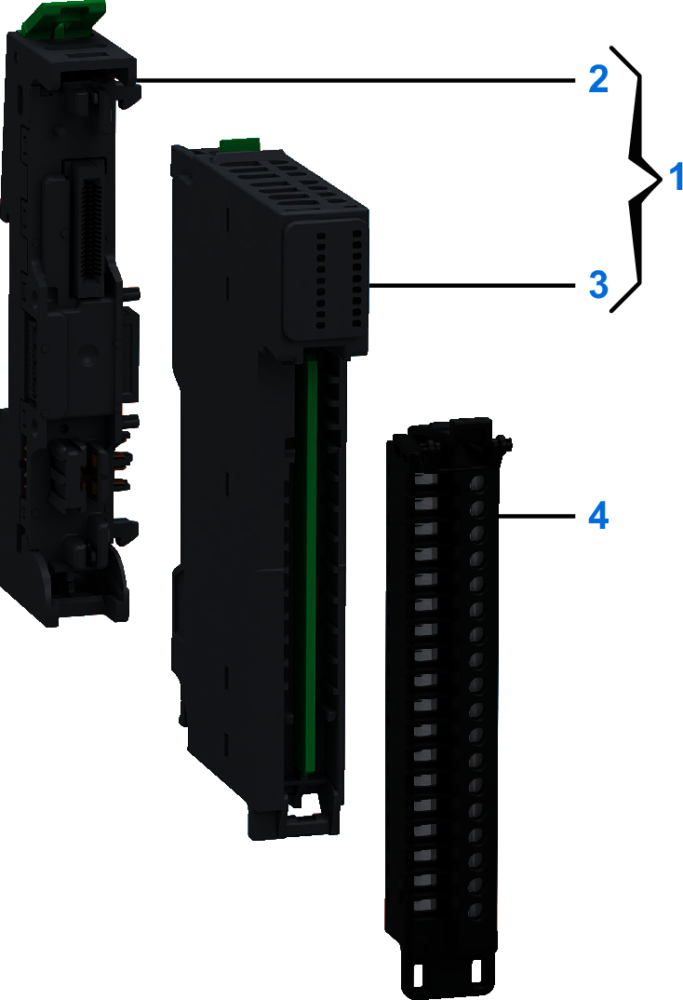

# Purchasing Information

The following figure presents the elements of the Modicon Edge I/O NTS NTSEDM0822 module:

| Number | Reference | Description |
| --- | --- | --- |
| 1 | NTSEDM0822K | Base + Module (kit)  NOTE: The module and its corresponding base can be purchased as a kit. |
| 2 | NTSXBA0100H | Spare Base, 1 Slot, for Input/Output Common or Expert Module, Hardened |
| 3 | NTSEDM0822 | Oversampled and Timestamped Mixed Module, 4 Inputs, 4 Outputs |
| 4 | NTSXTB18000H | Screw Terminal Block, 18 Points, 3.81 mm Pitch, Without Cover, use on Low Height Module, Hardened |
| NTSXTB18001H | Screw Terminal Block, 18 Points, 3.81 mm Pitch, With Cover, use on Low Height Module, Hardened |
| NTSXTB18200H | Spring Terminal Block, 18 Points, 3.81 mm Pitch, Without Cover, use on Low Height Module, Hardened |
| NTSXTB18201H | Spring Terminal Block, 18 Points, 3.81 mm Pitch, With Cover, use on Low Height Module, Hardened **NOTE:** The terminal blocks are purchased separately. |

NOTE: For more information on accessories and spare parts, refer to Modicon Edge I/O - System Planning and Installation Guide.

EIO0000005254.00