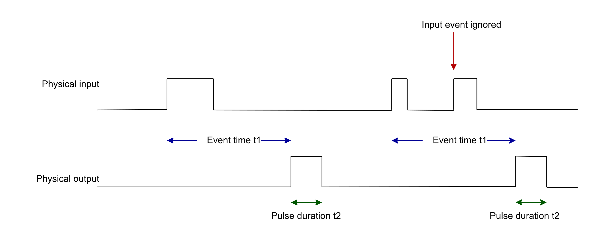

# Principle Diagram

The following diagram depicts an overview of the Output Pulse After Input Event mode:

The input event can be triggered on rising/falling/both edges:

* 0 nominal, 1 pulse

The Event and Pulse Time are part of the I/O variable, and can be modified each cycle.

The number of generated pulses is counted. This number is part of the I/O variable and increments at the end of the pulse. During Event and Pulse Time, any other input events are ignored.

EIO0000005254.00