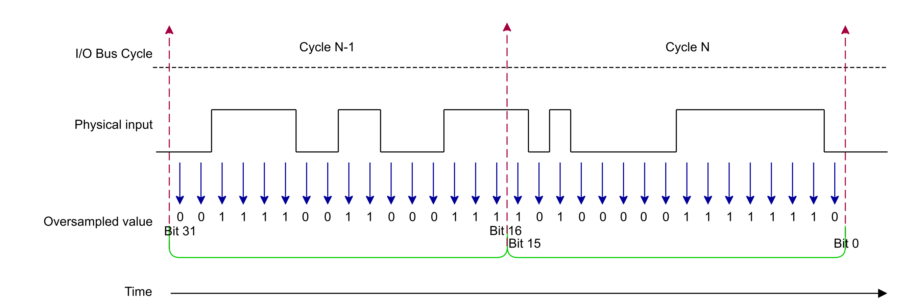

# Principle Diagram

In the following diagram, the oversampling Input mode is configured with the following parameters:

* IO Bus Cycle Time = 1 ms
* Sampling Step Mode = 16 bits

The physical input is divided into 16 steps of 62.5 μs and recorded into in the OversampledInputValue word.

At each cycle, OversampledInputValue is updated and is a combination of the value recorded during the cycle N-1 with the value recorded during the cycle N.

In the example provided, OversampledInputValue = 0011 1100 1100 0111 1010 0000 1111 1110 bin (or 1,019,715,838 dec).

EIO0000005254.00