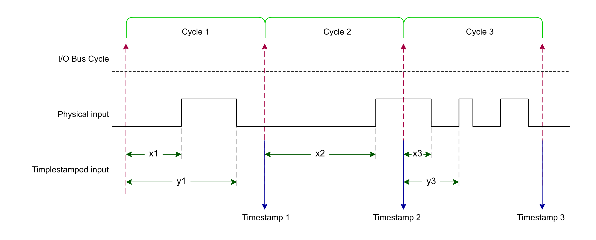

# Principle Diagram

The following diagram depicts an overview of the Timestamp Input mode:

When Enable is TRUE, at each cycle, the values of the timestamp function are updated:

|  |  |
| --- | --- |
| Timestamp 1 | TimestampInputRisingEdge = x1  TimestampInputFallingEdge = y1  TimestampInputNbRising = 1  TimestampInputNbFalling = 1 |
| Timestamp 2 | TimestampInputRisingEdge = x2  TimestampInputFallingEdge = y1  TimestampInputNbRising = 2  TimestampInputNbFalling = 1 |
| Timestamp 3 | TimestampInputRisingEdge = x3  TimestampInputFallingEdge = y3  TimestampInputNbRising = 4  TimestampInputNbFalling = 4 |

EIO0000005254.00