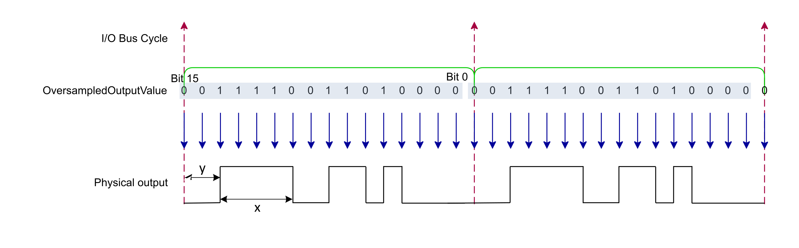

# Principle Diagram

In the following diagram, the oversampling Input mode is configured with the following parameters:

* IO Bus Cycle Time = 1 ms
* Sampling Step Mode = 16 bits
* OversampledOutputValue = 0011 1100 1101 0000 bin (15,568 dec)
* NbCycle = 0

The Oversampling Output mode divides the IO Bus Cycle Time into 16 steps of 62.5 μs and generates the output profile defined by OversampledOutputValue:

In this example, the output profile starts by 2 steps at FALSE for a duration of y = 125 μs (2 x 62.5 μs) and continues with 4 steps at TRUE for a duration of x = 250 μs (4 x 62.5 μs) and so on. The output generation is set to infinite generation (NbCycle = 0), the output profile is repeated at the next IO Bus Cycle Time.

The generation can be performed:

* Continuously: An infinite generation
* For a number of cycles: The generation stops when the number of cycles to generate is reached

It is possible to abort the generation by the software in both cases.

The output profile can be adjusted dynamically between each cycle during the generation.

EIO0000005254.00